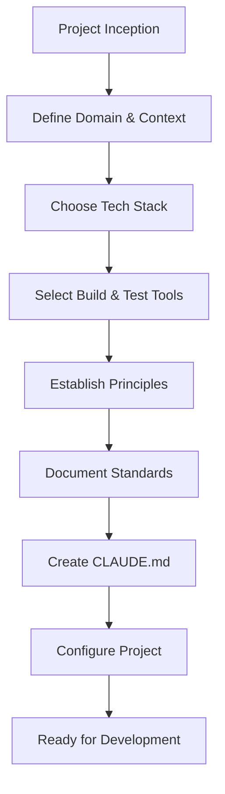

# Workflow 0: Project Standards & Configuration

## Purpose
Establish clear project standards, technology choices, and development principles before any implementation begins. This creates a consistent foundation that Claude can follow throughout the project.

## When to Use
- At project inception
- Before starting work with Claude
- When onboarding new team members
- During major architecture reviews
- When considering technology changes

## The Workflow



## Step-by-Step Process

### Step 1: Define Domain and Context
Clearly establish what you're building and for whom.

### Step 2: Choose Technology Stack
Select languages, frameworks, and runtime environments.

### Step 3: Select Build and Test Tools
Decide on build systems, test frameworks, and CI/CD tools.

### Step 4: Establish Development Principles
Choose architectural patterns and coding principles.

### Step 5: Document Standards
Create comprehensive documentation for all decisions.

### Step 6: Create CLAUDE.md
Provide Claude-specific instructions and context.

### Step 7: Configure Project
Set up tools, scripts, and initial structure.

## Standards Template

```markdown
# Project Standards: [Project Name]
Version: 1.0
Date: YYYY-MM-DD
Status: Active

## 1. Project Domain & Context

### Industry/Domain
- **Primary Domain**: [e.g., Interactive Fiction Platform Development]
- **Secondary Domains**: [e.g., Gaming, Educational Technology]
- **Target Users**: [e.g., Story Authors, Game Players]

### Business Context
- **Project Type**: [Product/Service/Platform/Tool]
- **Deployment Model**: [SaaS/On-Premise/Hybrid/Library]
- **Scale**: [Prototype/MVP/Production]
- **Criticality**: [Experimental/Business-Critical/Life-Critical]

### Domain-Specific Requirements
- **Regulatory Compliance**: [GDPR/HIPAA/PCI-DSS/None]
- **Performance Requirements**: [Real-time/Batch/Interactive]
- **Security Level**: [Public/Internal/Confidential/Secret]
- **Availability Requirements**: [99.9%/99.99%/Best-effort]

## 2. Technology Stack

### Core Languages
```yaml
Primary Language: [Language Choice]
  Version: X.X
  Configuration: [strict/standard]
  Target: [compilation target if applicable]
  Module System: [ESM/CommonJS/etc.]

Secondary Languages:
  - JavaScript (for legacy compatibility)
  - SQL (for data queries)
  - Bash (for automation scripts)
```

### Runtime Environment
```yaml
Runtime: Node.js
  Version: 20.x LTS
  Package Manager: pnpm
  Version Manager: nvm

Alternative Runtimes:
  - Deno (experimental features)
  - Bun (performance testing)
```

### Framework Choices
```yaml
Backend Framework: [Express/Fastify/NestJS/None]
  Version: X.X
  Rationale: [Why this choice]

Frontend Framework: [React/Vue/Svelte/None]
  Version: X.X
  Rationale: [Why this choice]

State Management: [Redux/MobX/Zustand/Context]
  Version: X.X
  Rationale: [Why this choice]
```

### Data Layer
```yaml
Database: [PostgreSQL/MongoDB/SQLite]
  Version: X.X
  ORM/ODM: [Prisma/TypeORM/Mongoose]
  
Cache: [Redis/Memcached/In-Memory]
  Version: X.X
  
Message Queue: [RabbitMQ/Kafka/Redis/None]
  Version: X.X
```

### Infrastructure
```yaml
Hosting: [AWS/Azure/GCP/Vercel/Self-hosted]
Container: [Docker/Podman/None]
Orchestration: [Kubernetes/Docker Swarm/None]
CDN: [CloudFlare/Fastly/AWS CloudFront/None]
```

## 3. Build & Development Tools

### Build System
```yaml
Build Tool: [Vite/Webpack/Rollup/esbuild/tsc]
  Version: X.X
  Configuration: [development/production/staging]
  
Task Runner: [npm scripts/Gulp/Grunt/Make]
  Primary Commands:
    - build: Full production build
    - dev: Development mode with watch
    - clean: Clear build artifacts

Monorepo Tool: [pnpm workspaces/Lerna/Nx/Turborepo]
  Structure: packages/*
  Shared Dependencies: workspace:*
```

### Testing Tools
```yaml
Test Framework: [Vitest/Jest/Mocha/Playwright]
  Version: X.X
  Configuration: vitest.config.ts
  
Coverage Tool: [c8/nyc/built-in]
  Target: 80%
  Reports: [text/html/lcov]

E2E Framework: [Playwright/Cypress/Puppeteer]
  Version: X.X
  Browsers: [Chrome/Firefox/Safari]

Performance Testing: [k6/Artillery/JMeter]
  Version: X.X
```

### Code Quality Tools
```yaml
Linter: [ESLint/Biome/TSLint]
  Version: X.X
  Config: .eslintrc.js
  Rules: [airbnb/standard/custom]

Formatter: [Prettier/Biome/dprint]
  Version: X.X
  Config: .prettierrc
  
Type Checker: [TypeScript/Flow/PropTypes/None]
  Config: [config file]
  Strict: true

Pre-commit Hooks: [Husky/Lefthook/pre-commit]
  Actions:
    - Lint staged files
    - Run affected tests
    - Check types
```

### Documentation Tools
```yaml
API Docs: [TypeDoc/JSDoc/Swagger]
Architecture: [C4/PlantUML/Mermaid]
User Docs: [VitePress/Docusaurus/MkDocs]
```

## 4. Development Principles

### Architectural Patterns
```yaml
Overall Architecture: [Layered/Hexagonal/Microservices/Monolithic]
  Rationale: [Why this fits the project]

Design Patterns:
  - Factory Pattern: For object creation
  - Observer Pattern: For event handling
  - Strategy Pattern: For algorithm selection
  - Repository Pattern: For data access

Anti-patterns to Avoid:
  - God Objects
  - Spaghetti Code
  - Copy-Paste Programming
  - Magic Numbers/Strings
```

### Core Principles

#### SOLID Principles
```yaml
Single Responsibility: ENFORCED
  - One class, one purpose
  - Clear separation of concerns
  
Open/Closed: ENFORCED
  - Open for extension, closed for modification
  - Use interfaces and abstractions

Liskov Substitution: ENFORCED
  - Subtypes must be substitutable
  - No surprising behaviors

Interface Segregation: ENFORCED
  - Many specific interfaces over general ones
  - No unused interface methods

Dependency Inversion: ENFORCED
  - Depend on abstractions, not concretions
  - Inject dependencies
```

#### DRY (Don't Repeat Yourself)
```yaml
Application: STRICT
  - Extract common logic to utilities
  - Use shared components
  - Centralize configuration
  
Exceptions:
  - Test data (clarity over DRY)
  - Performance-critical sections
```

#### Domain-Driven Design (DDD)
```yaml
Application Level: [Full/Partial/Light/None]

Concepts Applied:
  - Bounded Contexts: Yes
  - Aggregates: Yes
  - Value Objects: Yes
  - Domain Events: Yes
  - Ubiquitous Language: Yes

Domain Boundaries:
  - Core Domain: [Main business logic]
  - Supporting Domains: [Helper functionality]
  - Generic Domains: [Common utilities]
```

#### Other Principles
```yaml
KISS (Keep It Simple): ENFORCED
  - Prefer simple solutions
  - Avoid premature optimization

YAGNI (You Aren't Gonna Need It): ENFORCED
  - Don't build for hypothetical futures
  - Implement when actually needed

Composition over Inheritance: PREFERRED
  - Use composition for code reuse
  - Inheritance only for true "is-a" relationships

Fail Fast: ENFORCED
  - Validate early
  - Clear error messages
  - No silent failures
```

## 5. Coding Standards

### Naming Conventions
```javascript
// Files
feature-name.ts          // Kebab case for files
FeatureName.tsx         // Pascal case for components
feature-name.test.ts    // Test files
feature-name.spec.ts    // Spec files

// Classes and Interfaces
class UserAccount { }    // Pascal case
interface IUserService { } // Prefix with 'I' (optional)
type UserRole = 'admin' | 'user'; // Pascal case

// Functions and Variables
function calculateTotal() { } // Camel case
const maxRetries = 3;        // Camel case
const MAX_TIMEOUT = 5000;    // SCREAMING_SNAKE for constants

// Private members
private _internalState;      // Prefix with underscore
#privateField;              // Or use private fields
```

### File Structure
```
src/
├── domain/           # Business logic
├── application/      # Use cases
├── infrastructure/   # External integrations
├── presentation/     # UI/API layer
├── shared/          # Cross-cutting concerns
└── tests/           # Test files
```

### Code Style
```javascript
// Import order
import { external } from 'external-package';
import { internal } from '@/internal';
import { relative } from './relative';

// Function style
// ✅ Preferred: Arrow functions for callbacks
array.map((item) => item.value);

// ✅ Preferred: Function declarations for named functions
function processData(input: Input): Output {
  return transform(input);
}

// Error handling
try {
  await riskyOperation();
} catch (error) {
  // Always handle errors explicitly
  logger.error('Operation failed', error);
  throw new DomainError('User-friendly message', error);
}
```

## 6. Shell Scripts Policy

### Shell Script Usage
```yaml
Use Shell Scripts: [YES/NO]
  Rationale: [Why or why not]

If YES:
  Shell: [Bash/Zsh/POSIX sh]
  Version: [4.0+/5.0+/POSIX]
  
  Location: scripts/
  Naming: kebab-case.sh
  
  Required Features:
    - Set flags: set -euo pipefail
    - Help text: --help flag
    - Error handling: trap ERR
    - Logging: to logs/ directory

  Use Cases:
    - Build automation
    - Deployment scripts
    - Development utilities
    - CI/CD pipelines

If NO:
  Alternative: [Node.js scripts/Make/npm scripts]
  Rationale: [Why chosen alternative is better]
```

### Script Standards
```bash
#!/usr/bin/env bash
# Script: script-name.sh
# Purpose: Clear description
# Usage: script-name.sh [options]

set -euo pipefail
IFS=$'\n\t'

# Constants
readonly SCRIPT_DIR="$(cd "$(dirname "${BASH_SOURCE[0]}")" && pwd)"
readonly LOG_FILE="logs/$(basename "$0" .sh)-$(date +%Y%m%d-%H%M).log"

# Functions
log() {
  echo "[$(date '+%Y-%m-%d %H:%M:%S')] $*" | tee -a "$LOG_FILE"
}

error_exit() {
  log "ERROR: $1"
  exit "${2:-1}"
}

# Main
main() {
  log "Starting script..."
  # Implementation
  log "Script completed successfully"
}

# Run
main "$@"
```

## 7. Testing Standards

### Test Structure
```yaml
Test Organization:
  - Unit Tests: src/**/*.test.ts
  - Integration Tests: tests/integration/
  - E2E Tests: tests/e2e/
  - Performance Tests: tests/performance/

Coverage Requirements:
  - Minimum Overall: 80%
  - Critical Paths: 100%
  - New Code: 90%
  
Test Naming:
  - describe('ComponentName')
  - it('should perform expected behavior')
  - test('edge case: handles null input')
```

### Test Patterns
```javascript
// Arrange-Act-Assert pattern
describe('UserService', () => {
  it('should create user with valid data', async () => {
    // Arrange
    const userData = { name: 'Test', email: 'test@example.com' };
    const service = new UserService();
    
    // Act
    const user = await service.create(userData);
    
    // Assert
    expect(user).toMatchObject(userData);
    expect(user.id).toBeDefined();
  });
});

// Given-When-Then for BDD
describe('Shopping Cart', () => {
  it('should apply discount when threshold met', () => {
    // Given a cart with items worth $100
    const cart = new Cart([item1, item2]);
    
    // When discount is calculated
    const discount = cart.calculateDiscount();
    
    // Then 10% discount should be applied
    expect(discount).toBe(10);
  });
});
```

## 8. Documentation Standards

### Code Documentation
```javascript
/**
 * Processes user input and returns formatted result
 * 
 * @param input - Raw user input string
 * @param options - Processing options
 * @returns Processed and formatted result
 * @throws {ValidationError} If input is invalid
 * @example
 * ```javascript
 * const result = processInput('test', { uppercase: true });
 * console.log(result); // 'TEST'
 * ```
 */
function processInput(input: string, options?: ProcessOptions): Result {
  // Implementation
}
```

### Project Documentation
```yaml
Required Documents:
  - README.md: Project overview and quick start
  - ARCHITECTURE.md: System design and decisions
  - CONTRIBUTING.md: How to contribute
  - CHANGELOG.md: Version history
  - API.md: API documentation
  - CLAUDE.md: Claude-specific instructions
```

## 9. Version Control Standards

### Git Workflow
```yaml
Branching Strategy: [GitFlow/GitHub Flow/Trunk-Based]

Branch Naming:
  - feature/description
  - bugfix/issue-number
  - hotfix/critical-fix
  - release/version

Commit Messages:
  Format: type(scope): description
  Types: [feat/fix/docs/style/refactor/test/chore]
  
  Examples:
    - feat(parser): add support for abbreviations
    - fix(auth): resolve token expiration issue
    - docs(api): update endpoint documentation
```

### Code Review Standards
```yaml
Review Requirements:
  - At least 1 approval required
  - CI/CD must pass
  - Coverage must not decrease
  - No unresolved comments

Review Checklist:
  - [ ] Code follows style guide
  - [ ] Tests are included
  - [ ] Documentation is updated
  - [ ] No security vulnerabilities
  - [ ] Performance impact considered
```

## 10. Performance Standards

### Performance Targets
```yaml
Response Times:
  - API: < 200ms p95
  - Page Load: < 3s
  - Time to Interactive: < 5s

Resource Limits:
  - Memory: < 512MB
  - CPU: < 80% sustained
  - Disk I/O: < 100MB/s

Scalability:
  - Concurrent Users: 1000
  - Requests/Second: 500
  - Database Connections: 100
```

### Optimization Guidelines
```yaml
Always:
  - Profile before optimizing
  - Measure impact of changes
  - Document performance decisions

Never:
  - Premature optimization
  - Micro-optimizations without profiling
  - Sacrifice readability for minor gains
```
```

## CLAUDE.md Template

Create a `CLAUDE.md` file in your project root:

```markdown
# Claude Development Instructions

## Project Context
This is [project description] built with [tech stack].

## Key Standards
- **Language**: [Your chosen language] with [configuration]
- **Testing**: Vitest with 80% coverage minimum
- **Architecture**: [Your architecture pattern]
- **Principles**: SOLID, DRY, DDD

## Development Workflow
1. Always use planning mode for new features
2. Create comprehensive tests before implementation
3. Document designs after completion
4. All builds/tests must be logged to logs/ directory

## Specific Instructions

### DO
- Use arrow functions for callbacks
- Prefer composition over inheritance
- Write comprehensive JSDoc comments
- Use dependency injection
- Follow [domain] best practices

### DON'T
- Use `any` type without explicit justification
- Create files without tests
- Commit without running tests
- Use magic numbers or strings
- Write complex functions (>20 lines)

## Testing Commands
```bash
# Use these exact commands
pnpm test                    # Full test suite
pnpm test:unit              # Unit tests only
pnpm test:integration       # Integration tests
pnpm build                  # Production build
```

## Common Patterns

### Error Handling
```javascript
// Always use this pattern
try {
  const result = await operation();
  return Result.success(result);
} catch (error) {
  logger.error('Operation failed', { error, context });
  return Result.failure('User-friendly message');
}
```

### Data Validation
```javascript
// Use validation schemas
const schema = z.object({
  name: z.string().min(1),
  age: z.number().positive(),
});

function process(input: unknown) {
  const validated = schema.parse(input);
  // Continue with type-safe data
}
```

## Project-Specific Context
- [Specific domain knowledge]
- [Important architectural decisions]
- [Performance requirements]
- [Security considerations]

## File Organization
Follow this structure:
- One class/interface per file
- Test file next to source file
- Shared types in types/ directory
- Utilities in utils/ directory

## Review Checklist
Before marking any task complete:
- [ ] Tests written and passing
- [ ] Type checking passes (if applicable)
- [ ] Documentation updated
- [ ] Logged output reviewed
- [ ] Design documented if significant
```

## Implementation Checklist

```markdown
# Project Standards Implementation Checklist

## Initial Setup
- [ ] Create project standards document
- [ ] Create CLAUDE.md file
- [ ] Configure build tools
- [ ] Set up testing framework
- [ ] Configure linting and formatting
- [ ] Create shell script templates (if using)
- [ ] Set up git hooks
- [ ] Create initial folder structure

## Configuration Files
- [ ] package.json with all scripts
- [ ] tsconfig.json with strict settings
- [ ] .eslintrc.js with team rules
- [ ] .prettierrc with formatting rules
- [ ] .gitignore with proper exclusions
- [ ] vitest.config.ts (or jest.config.js)
- [ ] docker-compose.yml (if using containers)

## Documentation
- [ ] README.md with quick start
- [ ] ARCHITECTURE.md with design decisions
- [ ] CONTRIBUTING.md with guidelines
- [ ] CLAUDE.md with AI instructions
- [ ] API.md with endpoint documentation

## Team Alignment
- [ ] Review standards with team
- [ ] Get consensus on principles
- [ ] Document any exceptions
- [ ] Set up training if needed
- [ ] Create example code

## Validation
- [ ] Run sample build
- [ ] Execute test suite
- [ ] Verify lint rules work
- [ ] Test shell scripts (if applicable)
- [ ] Confirm Claude understands CLAUDE.md
```

## Best Practices

### 1. Be Specific
✅ "Use Python 3.11 with type hints, target production environment"
❌ "Use Python"

### 2. Explain Rationale
✅ "Use pnpm for 30% faster installs and disk space efficiency"
❌ "Use pnpm"

### 3. Show Examples
✅ Include code snippets showing the standard
❌ Only describe in words

### 4. Allow Exceptions
✅ "DRY except in tests where clarity matters more"
❌ "Always follow DRY"

### 5. Keep Updated
✅ Version the standards document and update regularly
❌ Set once and forget

## Common Configurations

### For Enterprise Applications
- Strongly typed language configuration
- SOLID principles strictly enforced
- High test coverage (>90%)
- Comprehensive documentation
- Security-first approach

### For Startups/MVPs
- Pragmatic over perfect
- Fast iteration cycles
- Minimum viable testing (>70%)
- Focus on core functionality
- Documentation as needed

### For Open Source Libraries
- Multiple environment support
- Extensive documentation
- Example code provided
- Backward compatibility
- Semantic versioning

### For Gaming/Interactive
- Performance-first design
- Real-time considerations
- State management focus
- User experience priority
- Creative flexibility

## Integration with Other Workflows

### Standards Enable Everything
1. Standards defined first
2. Planning uses standards as constraints
3. Implementation follows standards
4. Reviews check against standards
5. Documentation references standards

## Metrics to Track

- **Standard Adherence**: % of code following standards
- **Review Rejections**: Due to standard violations
- **Tech Debt**: Deviations from standards
- **Update Frequency**: How often standards evolve
- **Team Satisfaction**: With chosen standards

## Next Steps

1. Define your project domain and requirements
2. Make technology choices based on needs
3. Document all decisions with rationale
4. Create CLAUDE.md for AI assistance
5. Configure tools to enforce standards
6. Begin development with clear guidelines

Remember: Good standards are living documents that evolve with your project!