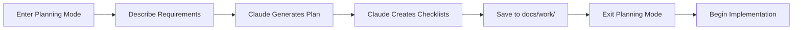

# Workflow 1: Planning Mode

## Purpose
Transform high-level requirements into detailed, actionable implementation plans with phase-based checklists.

## When to Use
- Before starting any significant feature or refactor
- When facing complex, multi-step tasks
- When you need to break down ambiguous requirements
- Before architectural changes that affect multiple components

## The Workflow



## Step-by-Step Process

### Step 1: Enter Planning Mode

```markdown
"Claude, I need to plan [task/feature]. Let's enter planning mode."
```

This signals Claude to:
- Focus exclusively on planning
- Avoid jumping into implementation
- Generate comprehensive documentation
- Structure output for `docs/work/`

### Step 2: Provide Context

```markdown
## Context
- Current state: [where the codebase is now]
- Desired state: [what we want to achieve]
- Constraints: [technical, time, or resource limitations]
- Dependencies: [what this relies on or affects]

## Requirements
1. [Functional requirement 1]
2. [Functional requirement 2]
3. [Non-functional requirement]

## Success Criteria
- [How we'll know this is complete]
- [Measurable outcome]
```

### Step 3: Claude Generates Plan

Claude will create a structured plan including:
- Phase breakdown with time estimates
- Dependencies between phases
- Risk analysis
- Alternative approaches
- Decision points

### Step 4: Claude Creates Checklists

For each phase, Claude generates detailed checklists with:
- Pre-phase setup steps
- Implementation tasks in order
- Validation checkpoints
- Documentation requirements
- Commit boundaries

### Step 5: Save Artifacts

All artifacts are saved to `docs/work/`:
```
docs/work/
├── feature-name-plan.md           # Overall implementation plan
├── feature-name-phase1-checklist.md
├── feature-name-phase2-checklist.md
└── feature-name-phase3-checklist.md
```

### Step 6: Exit Planning Mode

```markdown
"Exit planning mode"
```

This transitions Claude to implementation mode where you can start executing the plan.

## Templates

### Planning Request Template

```markdown
"Claude, I need to plan the implementation of [feature name]. Let's enter planning mode."

## Background
[1-2 paragraphs of context about why this is needed]

## Current State
- Existing implementation: [what exists now]
- Pain points: [what problems we're solving]
- Technical debt: [what needs addressing]

## Requirements
### Functional Requirements
1. [User-facing requirement]
2. [Business logic requirement]
3. [Integration requirement]

### Non-Functional Requirements
1. Performance: [specific metrics]
2. Security: [specific concerns]
3. Maintainability: [specific goals]

## Constraints
- Must maintain: [backward compatibility/API contracts]
- Cannot change: [external dependencies]
- Time limit: [deadline if any]
- Resource limit: [team/budget constraints]

## Dependencies
- Requires: [what must exist first]
- Affects: [what will be impacted]
- Integrates with: [existing systems]

Please create:
1. A phased implementation plan (aim for 3-5 phases)
2. Detailed checklists for each phase
3. Risk analysis with mitigation strategies
4. Time estimates for each phase
5. Alternative approaches if primary path fails
```

### Generated Plan Format

```markdown
# Implementation Plan: [Feature Name]
Generated: [Date]
Estimated Duration: [Total time]
Risk Level: [Low/Medium/High]

## Executive Summary
[2-3 sentences describing the approach and expected outcome]

## Phase Breakdown

### Phase 1: Foundation [~X hours]
**Goal**: [Specific, measurable outcome]
**Dependencies**: None / [List specific dependencies]
**Risk**: [Low/Medium/High]

Key tasks:
1. [High-level task with outcome]
2. [High-level task with outcome]
3. [High-level task with outcome]

**Deliverables**:
- [Specific file or component]
- [Test coverage for X]
- [Documentation for Y]

**Checklist**: `docs/work/feature-phase1-checklist.md`

**Success Criteria**:
- [ ] All unit tests pass
- [ ] No type/compilation errors
- [ ] [Specific validation]

### Phase 2: Core Implementation [~X hours]
**Goal**: [Specific, measurable outcome]
**Dependencies**: Phase 1 complete
**Risk**: [Low/Medium/High]

Key tasks:
1. [High-level task with outcome]
2. [High-level task with outcome]

**Deliverables**:
- [Specific features]
- [Integration points]

**Checklist**: `docs/work/feature-phase2-checklist.md`

**Success Criteria**:
- [ ] Integration tests pass
- [ ] Performance baseline met
- [ ] [Specific validation]

### Phase 3: Polish & Validation [~X hours]
**Goal**: [Specific, measurable outcome]
**Dependencies**: Phase 2 complete
**Risk**: [Low/Medium/High]

Key tasks:
1. [High-level task with outcome]
2. [High-level task with outcome]

**Deliverables**:
- [Final features]
- [Complete documentation]
- [Performance optimization]

**Checklist**: `docs/work/feature-phase3-checklist.md`

**Success Criteria**:
- [ ] All tests pass
- [ ] Documentation complete
- [ ] Ready for review

## Risk Analysis

| Risk | Probability | Impact | Mitigation Strategy |
|------|------------|--------|-------------------|
| [Technical risk] | High | High | [Specific mitigation] |
| [Integration risk] | Medium | High | [Specific mitigation] |
| [Performance risk] | Low | Medium | [Specific mitigation] |

## Decision Points

1. **After Phase 1**: Validate approach or pivot to Alternative A
2. **Mid-Phase 2**: Performance check - if >Xms, implement caching
3. **Before Phase 3**: API review with team

## Alternative Approaches

### Alternative A: [Different Approach Name]
- **When to use**: If [specific condition]
- **Pros**: [Advantages]
- **Cons**: [Disadvantages]
- **Implementation notes**: [Key differences]

### Alternative B: [Different Approach Name]
- **When to use**: If [specific condition]
- **Pros**: [Advantages]
- **Cons**: [Disadvantages]
- **Implementation notes**: [Key differences]

## Resources and References
- [Link to relevant ADR]
- [Link to similar implementation]
- [External documentation]
```

### Checklist Template

```markdown
# Checklist: [Feature] - Phase [N]: [Phase Name]
Status: [ ] Not Started | [ ] In Progress | [ ] Complete
Estimated Time: [X hours]
Actual Time: [Track as you go]

## Pre-Phase Checklist
- [ ] Read implementation plan: `docs/work/feature-plan.md`
- [ ] Review existing code in: 
  - [ ] `packages/[package]/src/[file1].ts`
  - [ ] `packages/[package]/src/[file2].ts`
- [ ] Ensure all tests pass: `pnpm test`
- [ ] Create feature branch: `git checkout -b feature/[name]`
- [ ] Pull latest changes: `git pull origin main`

## Implementation Tasks

### Section 1: [Task Group Name] [~X minutes]
Purpose: [What this section accomplishes]

- [ ] Open `path/to/specific/file.js`
- [ ] Locate the `functionName()` function at line ~XXX
- [ ] Add the following interface above it:
  ```javascript
  // Interface or class structure
  class NewComponent {
    // properties
  }
  ```
- [ ] Update function signature to accept `NewInterface`
- [ ] Run type check: `[type check command]`
- [ ] If errors, fix before proceeding

### Section 2: [Task Group Name] [~X minutes]
Purpose: [What this section accomplishes]

- [ ] Create new file: `path/to/new-component.js`
- [ ] Add initial structure:
  ```javascript
  // Template for the component
  export class ComponentName {
    constructor() {
      // Initialize
    }
    
    methodName(): ReturnType {
      // Implement
    }
  }
  ```
- [ ] Create corresponding test file: `path/to/new-component.test.js`
- [ ] Add basic test structure:
  ```javascript
  describe('ComponentName', () => {
    it('should initialize', () => {
      // Test
    });
  });
  ```
- [ ] Run test: `pnpm test new-component`

### Section 3: Integration [~X minutes]
Purpose: Wire new components into existing system

- [ ] Open `packages/[package]/src/index.ts`
- [ ] Add export: `export { ComponentName } from './new-component';`
- [ ] Open `packages/[consumer]/src/[file].ts`
- [ ] Import new component
- [ ] Replace old implementation with new
- [ ] Test integration: `pnpm test [specific-test]`

## Validation Checklist
- [ ] All new tests pass: `pnpm test [new-tests]`
- [ ] All existing tests pass: `pnpm test`
- [ ] No type errors: `[type check command]`
- [ ] Build succeeds: `pnpm build`
- [ ] Lint passes: `pnpm lint`
- [ ] Manual test scenario 1: [Specific steps]
- [ ] Manual test scenario 2: [Specific steps]

## Documentation Tasks
- [ ] Add JSDoc comments to all public methods
- [ ] Update README if API changed
- [ ] Create/update ADR if architectural decision made
- [ ] Add usage example if new feature

## Commit Checklist
- [ ] Stage only related changes: review with `git status`
- [ ] Ensure no debug code remains
- [ ] Commit message format: `feat(scope): description`
- [ ] Reference issue if applicable: `Fixes #XXX`
- [ ] Push to feature branch: `git push origin feature/[name]`

## Phase Handoff
If stopping here, note:
- [ ] Current state: [What's complete]
- [ ] Next step: [Exactly what to do next]
- [ ] Any blockers: [Issues encountered]
- [ ] Time spent so far: [X hours]

## Notes Section
[Space for tracking issues, discoveries, or deviations from plan]
```

## Best Practices

### 1. Be Specific in Requirements
❌ "Make the parser better"
✅ "Add support for abbreviated commands (n/north, e/east) with disambiguation"

### 2. Include Context
❌ "Add caching"
✅ "Add caching to reduce parser initialization time from 500ms to <50ms"

### 3. Identify Dependencies Early
❌ Start planning without checking prerequisites
✅ List all required components and their current state

### 4. Keep Phases Small
❌ Phase 1: Implement entire feature (8 hours)
✅ Phase 1: Foundation (2 hours), Phase 2: Core (3 hours), Phase 3: Polish (2 hours)

### 5. Make Checklists Atomic
❌ "Update the component"
✅ "Open `src/component.ts`, find line 42, change `oldMethod` to `newMethod`"

## Common Patterns

### Pattern 1: Refactoring Plan
```markdown
Phase 1: Add new implementation alongside old
Phase 2: Migrate consumers one by one
Phase 3: Remove old implementation
```

### Pattern 2: Feature Addition Plan
```markdown
Phase 1: Core data structures and types
Phase 2: Business logic implementation
Phase 3: UI/API integration
Phase 4: Documentation and examples
```

### Pattern 3: Performance Optimization Plan
```markdown
Phase 1: Benchmark current performance
Phase 2: Implement optimizations
Phase 3: Validate improvements
Phase 4: Document changes
```

## Troubleshooting

### Issue: Plan too vague
**Solution**: Ask Claude to be more specific about file paths, line numbers, and exact changes.

### Issue: Phases too large
**Solution**: Ask Claude to break down further - aim for 2-3 hour phases maximum.

### Issue: Missing validation steps
**Solution**: Explicitly request test commands and success criteria for each phase.

### Issue: No alternative approaches
**Solution**: Ask "What if [constraint] changes?" to explore alternatives.

## Examples from Real Projects

### Example 1: Parser Refactor
```markdown
"Claude, I need to plan a refactor of our parser to support dynamic vocabulary loading."

[Generated 4-phase plan with 12 total checklists, completed over 3 days]
```

### Example 2: Event System Design
```markdown
"Claude, let's plan the implementation of a new event emission system with type safety."

[Generated 3-phase plan focusing on type safety, backward compatibility, and performance]
```

### Example 3: Test Migration
```markdown
"Claude, I need to plan migrating our test suite from Jest to Vitest."

[Generated 5-phase plan with gradual migration strategy]
```

## Metrics to Track

- **Planning Time**: How long to generate plan (target: <30 minutes)
- **Phase Accuracy**: Actual time vs estimated (target: ±20%)
- **Checklist Completeness**: Items needed to add during execution (target: <5%)
- **Rework Rate**: How often you deviate from plan (target: <10%)

## Next Steps

After planning is complete:
1. Review the generated plan for completeness
2. Adjust time estimates based on your pace
3. Exit planning mode
4. Begin with Phase 1 checklist
5. Track actual time vs estimates for future calibration

Remember: A good plan today is better than a perfect plan tomorrow. Start planning, start building!