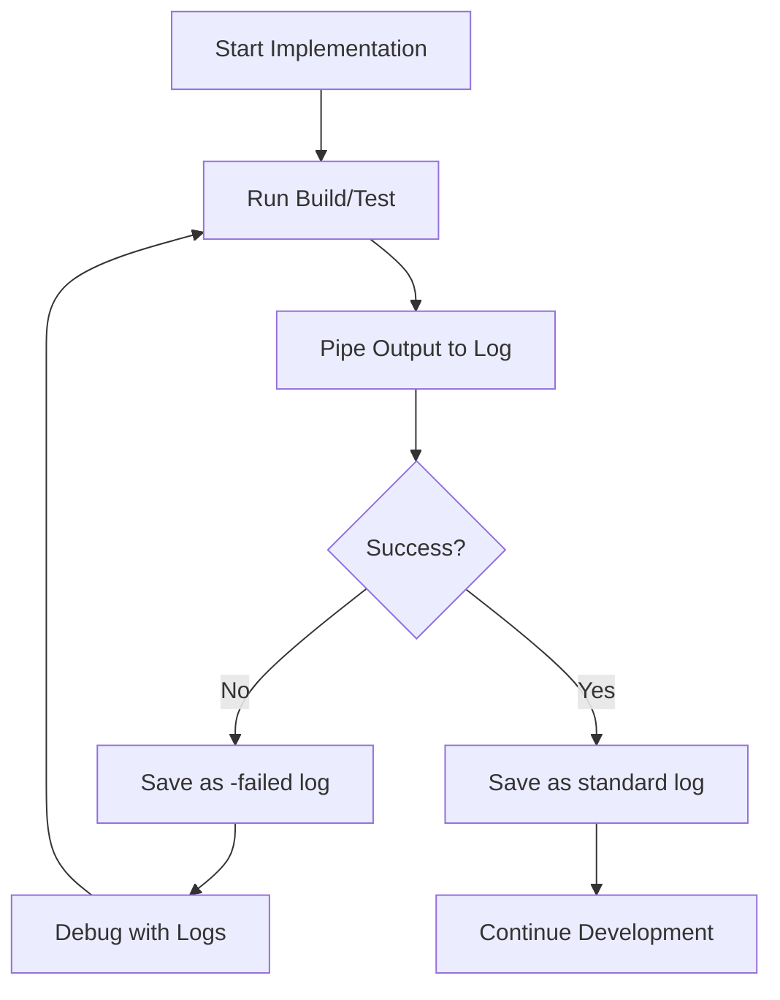

# Workflow 2: Implementation with Build & Test Logging

## Purpose
Execute implementation plans while maintaining comprehensive logs of all build and test runs for debugging, analysis, and progress tracking.

## When to Use
- During active development phases
- When debugging test failures
- For performance regression tracking
- When documenting build issues
- During CI/CD troubleshooting

## The Workflow



## Log Structure

```
logs/
├── package-build-20241228-1430.log      # Successful build
├── package-build-20241228-1445-failed.log # Failed build
├── package-test-20241228-1450.log       # Full test run
├── package-test-20241228-1455-failed.log # Failed tests only
├── parser-build-20241228-1500.log       # Package-specific build
├── parser-test-20241228-1505.log        # Package-specific test
└── engine-test-20241228-1510-failed.log # Failed tests for engine
```

## Step-by-Step Process

### Step 1: Configure Git Ignore
Ensure `.gitignore` includes:
```gitignore
# Build and test logs
logs/
*.log
```

### Step 2: Create Log Directory
```bash
mkdir -p logs
```

### Step 3: Run Commands with Logging

#### Build Commands
```bash
# Full build with logging
pnpm build 2>&1 | tee logs/all-build-$(date +%Y%m%d-%H%M).log

# Package-specific build
npm run build:parser 2>&1 | tee logs/parser-build-$(date +%Y%m%d-%H%M).log

# Build with error checking
if ! pnpm build 2>&1 | tee logs/all-build-$(date +%Y%m%d-%H%M).log; then
    mv logs/all-build-$(date +%Y%m%d-%H%M).log logs/all-build-$(date +%Y%m%d-%H%M)-failed.log
fi
```

#### Test Commands
```bash
# Full test suite with logging
pnpm test 2>&1 | tee logs/all-test-$(date +%Y%m%d-%H%M).log

# Package-specific tests
npm run test:parser 2>&1 | tee logs/parser-test-$(date +%Y%m%d-%H%M).log

# Test with failure detection
if ! pnpm test 2>&1 | tee logs/all-test-$(date +%Y%m%d-%H%M).log; then
    # Rerun failed tests only
    pnpm test --failed 2>&1 | tee logs/all-test-$(date +%Y%m%d-%H%M)-failed.log
fi
```

## Shell Scripts for Automation

### Build Script: `scripts/build-with-log.sh`

```bash
#!/bin/bash
# Build with automatic logging

set -euo pipefail

# Configuration
LOG_DIR="logs"
TIMESTAMP=$(date +%Y%m%d-%H%M)
PACKAGE=${1:-all}

# Ensure log directory exists
mkdir -p "$LOG_DIR"

# Determine command and log file
if [ "$PACKAGE" = "all" ]; then
    BUILD_CMD="pnpm build"
    LOG_FILE="$LOG_DIR/all-build-$TIMESTAMP.log"
else
    BUILD_CMD="npm run build:$PACKAGE"
    LOG_FILE="$LOG_DIR/$PACKAGE-build-$TIMESTAMP.log"
fi

echo "🔨 Building $PACKAGE..."
echo "📝 Logging to: $LOG_FILE"

# Run build with logging
if $BUILD_CMD 2>&1 | tee "$LOG_FILE"; then
    echo "✅ Build successful!"
    echo "📄 Log saved: $LOG_FILE"
else
    FAILED_LOG="${LOG_FILE%.log}-failed.log"
    mv "$LOG_FILE" "$FAILED_LOG"
    echo "❌ Build failed!"
    echo "📄 Error log: $FAILED_LOG"
    echo "🔍 Analyzing errors..."
    grep -E "ERROR|Error|error" "$FAILED_LOG" | head -10
    exit 1
fi
```

### Test Script: `scripts/test-with-log.sh`

```bash
#!/bin/bash
# Test with automatic logging and rerun capabilities

set -uo pipefail

# Configuration
LOG_DIR="logs"
TIMESTAMP=$(date +%Y%m%d-%H%M)
PACKAGE=${1:-all}
MODE=${2:-full} # full, failed, watch

# Ensure log directory exists
mkdir -p "$LOG_DIR"

# Determine command and log file
if [ "$PACKAGE" = "all" ]; then
    TEST_CMD="pnpm test"
    LOG_PREFIX="all"
else
    TEST_CMD="npm run test:$PACKAGE"
    LOG_PREFIX="$PACKAGE"
fi

# Add mode-specific flags
case $MODE in
    failed)
        TEST_CMD="$TEST_CMD --failed"
        LOG_FILE="$LOG_DIR/$LOG_PREFIX-test-$TIMESTAMP-failed.log"
        ;;
    watch)
        TEST_CMD="$TEST_CMD --watch"
        LOG_FILE="$LOG_DIR/$LOG_PREFIX-test-$TIMESTAMP-watch.log"
        ;;
    *)
        LOG_FILE="$LOG_DIR/$LOG_PREFIX-test-$TIMESTAMP.log"
        ;;
esac

echo "🧪 Testing $PACKAGE ($MODE mode)..."
echo "📝 Logging to: $LOG_FILE"

# Run tests with logging
if $TEST_CMD 2>&1 | tee "$LOG_FILE"; then
    echo "✅ All tests passed!"
    echo "📄 Log saved: $LOG_FILE"
    
    # Extract summary
    echo ""
    echo "📊 Test Summary:"
    grep -E "Test Suites:|Tests:|Time:" "$LOG_FILE" | tail -3
else
    EXIT_CODE=$?
    echo "❌ Tests failed!"
    
    # If this was a full run, automatically run failed tests only
    if [ "$MODE" = "full" ]; then
        FAILED_LOG="$LOG_DIR/$LOG_PREFIX-test-$TIMESTAMP-failed.log"
        echo "🔄 Rerunning failed tests only..."
        
        if [ "$PACKAGE" = "all" ]; then
            pnpm test --failed 2>&1 | tee "$FAILED_LOG"
        else
            npm run test:$PACKAGE -- --failed 2>&1 | tee "$FAILED_LOG"
        fi
        
        echo "📄 Failed tests log: $FAILED_LOG"
        echo ""
        echo "🔍 Failed test summary:"
        grep -E "FAIL|✕" "$FAILED_LOG" | head -10
    fi
    
    exit $EXIT_CODE
fi
```

### Analysis Script: `scripts/analyze-logs.sh`

```bash
#!/bin/bash
# Analyze build and test logs

LOG_DIR="logs"

echo "📊 Log Analysis Report"
echo "====================="
echo ""

# Recent failures
echo "🔴 Recent Failures (last 5):"
ls -lt "$LOG_DIR"/*-failed.log 2>/dev/null | head -5 | while read -r line; do
    echo "  - $(basename $(echo $line | awk '{print $NF}'))"
done
echo ""

# Success rate
TOTAL_BUILDS=$(ls "$LOG_DIR"/*-build-*.log 2>/dev/null | wc -l)
FAILED_BUILDS=$(ls "$LOG_DIR"/*-build-*-failed.log 2>/dev/null | wc -l)
SUCCESS_BUILDS=$((TOTAL_BUILDS - FAILED_BUILDS))

echo "🏗️  Build Statistics:"
echo "  Total builds: $TOTAL_BUILDS"
echo "  Successful: $SUCCESS_BUILDS"
echo "  Failed: $FAILED_BUILDS"
if [ $TOTAL_BUILDS -gt 0 ]; then
    SUCCESS_RATE=$((SUCCESS_BUILDS * 100 / TOTAL_BUILDS))
    echo "  Success rate: $SUCCESS_RATE%"
fi
echo ""

# Test statistics
TOTAL_TESTS=$(ls "$LOG_DIR"/*-test-*.log 2>/dev/null | wc -l)
FAILED_TESTS=$(ls "$LOG_DIR"/*-test-*-failed.log 2>/dev/null | wc -l)
SUCCESS_TESTS=$((TOTAL_TESTS - FAILED_TESTS))

echo "🧪 Test Statistics:"
echo "  Total test runs: $TOTAL_TESTS"
echo "  Successful: $SUCCESS_TESTS"
echo "  Failed: $FAILED_TESTS"
if [ $TOTAL_TESTS -gt 0 ]; then
    SUCCESS_RATE=$((SUCCESS_TESTS * 100 / TOTAL_TESTS))
    echo "  Success rate: $SUCCESS_RATE%"
fi
echo ""

# Common errors
echo "⚠️  Common Errors (top 5):"
grep -h -E "ERROR|Error" "$LOG_DIR"/*-failed.log 2>/dev/null | \
    sed 's/.*ERROR/ERROR/' | \
    sort | uniq -c | sort -rn | head -5
echo ""

# Recent activity
echo "🕒 Recent Activity (last 10 logs):"
ls -lt "$LOG_DIR"/*.log | head -10 | while read -r line; do
    FILE=$(echo $line | awk '{print $NF}')
    SIZE=$(echo $line | awk '{print $5}')
    DATE=$(echo $line | awk '{print $6, $7, $8}')
    echo "  - $(basename $FILE) ($SIZE bytes) - $DATE"
done
```

## Log Management

### Cleanup Script: `scripts/cleanup-logs.sh`

```bash
#!/bin/bash
# Clean up old logs

LOG_DIR="logs"
DAYS_TO_KEEP=${1:-7}

echo "🧹 Cleaning logs older than $DAYS_TO_KEEP days..."

# Count files before cleanup
BEFORE=$(find "$LOG_DIR" -name "*.log" -type f | wc -l)

# Remove old logs
find "$LOG_DIR" -name "*.log" -type f -mtime +$DAYS_TO_KEEP -delete

# Count files after cleanup
AFTER=$(find "$LOG_DIR" -name "*.log" -type f | wc -l)

REMOVED=$((BEFORE - AFTER))
echo "✅ Removed $REMOVED old log files"
echo "📊 Remaining logs: $AFTER"
```

### Archive Script: `scripts/archive-logs.sh`

```bash
#!/bin/bash
# Archive logs for long-term storage

LOG_DIR="logs"
ARCHIVE_DIR="logs-archive"
DATE=$(date +%Y%m%d)

mkdir -p "$ARCHIVE_DIR"

# Create archive
ARCHIVE_FILE="$ARCHIVE_DIR/logs-$DATE.tar.gz"
tar -czf "$ARCHIVE_FILE" "$LOG_DIR"/*.log 2>/dev/null

if [ $? -eq 0 ]; then
    echo "✅ Logs archived to: $ARCHIVE_FILE"
    
    # Optional: Clear logs after archiving
    read -p "Clear archived logs? (y/n) " -n 1 -r
    echo
    if [[ $REPLY =~ ^[Yy]$ ]]; then
        rm "$LOG_DIR"/*.log
        echo "✅ Logs cleared"
    fi
else
    echo "❌ No logs to archive"
fi
```

## Usage Patterns

### Pattern 1: Development Cycle
```bash
# Start development
./scripts/build-with-log.sh          # Build everything
./scripts/test-with-log.sh           # Run all tests

# Make changes
vim src/component.ts

# Test specific package
./scripts/test-with-log.sh parser    # Test parser only

# If tests fail, debug with failed-only
./scripts/test-with-log.sh parser failed

# Check recent failures
./scripts/analyze-logs.sh
```

### Pattern 2: Debugging Session
```bash
# Run tests, capturing failure
./scripts/test-with-log.sh

# Analyze the failure log
less logs/all-test-20241228-1430-failed.log

# Fix issue and rerun failed tests
./scripts/test-with-log.sh all failed

# Verify fix with full run
./scripts/test-with-log.sh
```

### Pattern 3: CI/CD Integration
```bash
# In CI pipeline
npm run build:logged
npm run test:logged

# On failure, artifact the logs
if [ -f logs/*-failed.log ]; then
    # Upload to artifact storage
    upload-artifacts logs/*-failed.log
fi
```

## Package.json Scripts

Add to your `package.json`:

```json
{
  "scripts": {
    "build:logged": "bash scripts/build-with-log.sh",
    "test:logged": "bash scripts/test-with-log.sh",
    "test:failed": "bash scripts/test-with-log.sh all failed",
    "logs:analyze": "bash scripts/analyze-logs.sh",
    "logs:clean": "bash scripts/cleanup-logs.sh",
    "logs:archive": "bash scripts/archive-logs.sh"
  }
}
```

## Advanced Logging Techniques

### Structured Logging with Timestamps

```bash
# Enhanced logging with timestamps
pnpm test 2>&1 | while IFS= read -r line; do
    echo "[$(date '+%Y-%m-%d %H:%M:%S')] $line"
done | tee logs/test-$(date +%Y%m%d-%H%M).log
```

### Performance Metrics Extraction

```bash
# Extract performance metrics from logs
grep -E "Time:|Duration:|Performance:" logs/*.log | \
    awk '{print $NF}' | \
    sort -n | \
    awk '{
        sum+=$1; 
        count++; 
        if(count==1) min=$1; 
        max=$1
    } END {
        print "Min:", min, "Max:", max, "Avg:", sum/count
    }'
```

### Error Pattern Analysis

```bash
# Find error patterns across logs
grep -h "Error" logs/*-failed.log | \
    sed 's/[0-9]//g' | \
    sort | uniq -c | sort -rn | \
    head -20 > logs/error-patterns.txt
```

## Integration with Claude Workflows

### Using Logs in Design Reviews

```markdown
"Review this design considering these test failures from logs/parser-test-20241228-failed.log"
```

### Session Context References

```markdown
## Build/Test History
- Last successful build: logs/all-build-20241228-1430.log
- Current test failures: logs/parser-test-20241228-1445-failed.log
- Error pattern: Timeout issues in async tests
```

### Planning Based on Logs

```markdown
"Based on the error patterns in logs/analyze-report.txt, plan a refactoring to address the systematic test failures"
```

## Best Practices

### 1. Always Log CI/CD Runs
✅ Every CI build generates a log
❌ Only log failures

### 2. Use Descriptive Log Names
✅ `parser-test-20241228-1430-failed.log`
❌ `test.log`

### 3. Separate Success from Failure
✅ Different naming for failed runs
❌ Single log file overwritten

### 4. Regular Cleanup
✅ Archive weekly, clean monthly
❌ Let logs accumulate indefinitely

### 5. Analyze Patterns
✅ Regular analysis of failure patterns
❌ Only look at individual failures

## Common Issues and Solutions

### Issue: Logs Too Large
**Solution**: Use log rotation or streaming
```bash
# Rotate large logs
pnpm test 2>&1 | rotatelogs logs/test-%Y%m%d-%H%M.log 10M
```

### Issue: Missing Error Context
**Solution**: Include more context lines
```bash
# Include context around errors
grep -B 5 -A 5 "Error" logs/test-failed.log
```

### Issue: Parallel Test Output Interleaved
**Solution**: Use sequential logging for debugging
```bash
# Force sequential test execution
pnpm test --runInBand 2>&1 | tee logs/test-sequential.log
```

## Metrics to Track

- **Build Success Rate**: % of successful builds over time
- **Test Flakiness**: Tests that fail intermittently
- **Error Frequency**: Most common error messages
- **Performance Trends**: Build/test duration over time
- **Failure Recovery Time**: Time from failure to fix

## Next Steps

1. Set up the logging scripts in your project
2. Add `.log` to `.gitignore`
3. Run your first logged build/test
4. Analyze patterns after a week
5. Adjust scripts based on your needs

Remember: Comprehensive logging is your debugging superpower!