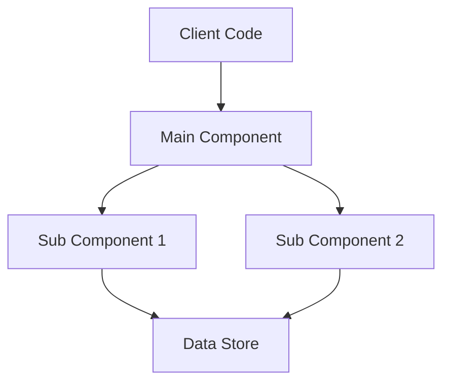

# Workflow 3: Design Documentation

## Purpose
Capture architectural decisions, implementation details, and design rationale after completing each phase of work.

## When to Use
- After completing a significant feature or component
- Following a major refactoring
- When architectural decisions have been made
- After solving complex technical problems
- Before requesting code review

## The Workflow


## Step-by-Step Process

### Step 1: Complete Implementation Phase
Ensure your implementation is:
- Functionally complete for the phase
- Tests are written and passing
- Code is committed
- Basic functionality is verified

### Step 2: Document While Fresh
Create documentation immediately while:
- Context is still in memory
- Decisions rationale is clear
- Trade-offs are remembered
- Problems and solutions are fresh

### Step 3: Use Design Template
Follow the structured template to ensure completeness.

### Step 4: Save to Designs Directory
Save as: `docs/designs/[feature-name]-design.md`
- Use descriptive names
- Include version numbers for iterations
- Keep all versions for reference

### Step 5: Prepare for Review
Design document becomes the artifact for review workflow.

## Design Document Template

```markdown
# Design: [Feature/Component Name]

## Metadata
- **Version**: 1.0
- **Date**: YYYY-MM-DD  
- **Author**: [Your name]
- **Status**: Initial | Reviewed | Refactored | Final
- **Implementation**: [Link to PR or commit]

## Overview

### Purpose
[2-3 sentences describing what this component/feature does and why it exists]

### Scope
**In Scope**:
- [What this design covers]
- [Specific functionality included]

**Out of Scope**:
- [What this design doesn't address]
- [Future considerations]

## Problem Statement

### Background
[Context about why this was needed, what problems existed]

### Requirements
1. **Functional Requirements**:
   - [User-facing requirement]
   - [Business logic requirement]

2. **Non-Functional Requirements**:
   - Performance: [Specific metrics]
   - Security: [Specific concerns]
   - Maintainability: [Specific goals]

### Constraints
- [Technical constraints]
- [Time constraints]
- [Resource constraints]
- [Compatibility requirements]

## Architecture

### High-Level Design

```javascript
// Core interfaces and types that define the architecture
interface MainComponent {
  // Public API
  method1(param: Type): ReturnType;
  method2(param: Type): Promise<ReturnType>;
}

interface SubComponent {
  // Supporting interfaces
}

type ConfigOptions = {
  // Configuration shape
};
```

### Component Architecture



### Data Flow

1. **Input Stage**: [How data enters the system]
2. **Processing Stage**: [How data is transformed]
3. **Output Stage**: [How results are returned]

Example flow:
```javascript
// Pseudo-code showing data flow
input -> validate -> transform -> process -> format -> output
```

## Implementation Details

### Core Components

#### [Component 1 Name]
**Purpose**: [What it does and why]

**Location**: `packages/[package]/src/[file].ts`

**Key Responsibilities**:
- [Responsibility 1]
- [Responsibility 2]

**Public API**:
```javascript
class ComponentName {
  constructor(config: Config);
  publicMethod1(param: Type): ReturnType;
  publicMethod2(): Promise<Result>;
}
```

**Implementation Notes**:
- [Important implementation detail]
- [Performance consideration]
- [Edge case handling]

#### [Component 2 Name]
**Purpose**: [What it does and why]

**Location**: `packages/[package]/src/[file].ts`

**Dependencies**:
- Depends on: [Component 1]
- Used by: [Component 3]

**Key Methods**:
```javascript
function helperFunction(input: Input): Output {
  // Core algorithm description
}
```

### Design Patterns Used

#### [Pattern Name]
**Where**: [Component/Module using it]
**Why**: [Reason for choosing this pattern]
**Implementation**:
```javascript
// Example of pattern implementation
class Factory {
  static create(type: string): Product {
    // Factory pattern example
  }
}
```

### State Management

**Approach**: [How state is managed]

**State Shape**:
```javascript
interface ApplicationState {
  component1State: Component1State;
  component2State: Component2State;
}
```

**State Transitions**:
- [State A] → [Action] → [State B]
- [State B] → [Action] → [State C]

### Error Handling Strategy

**Error Types**:
```javascript
class ValidationError extends Error {
  constructor(public field: string, public value: unknown) {
    super(`Invalid ${field}: ${value}`);
  }
}

class NetworkError extends Error {
  constructor(public statusCode: number) {
    super(`Network error: ${statusCode}`);
  }
}
```

**Error Flow**:
1. Errors are caught at boundaries
2. Wrapped with context
3. Logged with details
4. User-friendly message returned

### Performance Considerations

#### Optimization 1: [Caching Strategy]
- **What**: Cache parsed results
- **Why**: Avoid repeated parsing
- **Impact**: 10x improvement for repeated operations

#### Optimization 2: [Lazy Loading]
- **What**: Load components on demand
- **Why**: Reduce initial bundle size
- **Impact**: 50% reduction in startup time

### Security Considerations

1. **Input Validation**: All inputs validated before processing
2. **Sanitization**: User inputs sanitized for injection attacks
3. **Authentication**: [How auth is handled if applicable]
4. **Authorization**: [How permissions are checked if applicable]

## API Surface

### Public API

```javascript
// Main export - what consumers use
export class MainAPI {
  constructor(config?: Partial<Config>);
  
  // Core functionality
  process(input: Input): Output;
  processAsync(input: Input): Promise<Output>;
  
  // Configuration
  configure(options: Partial<Config>): void;
  
  // Event handling
  on(event: EventType, handler: Handler): void;
  off(event: EventType, handler: Handler): void;
}

// Supporting types
export interface Input {
  data: string;
  options?: ProcessOptions;
}

export interface Output {
  result: ProcessedData;
  metadata: Metadata;
}
```

### Internal API

```javascript
// Internal interfaces - not exported but important for understanding
interface InternalProcessor {
  validate(input: unknown): Input;
  transform(input: Input): IntermediateForm;
  optimize(form: IntermediateForm): OptimizedForm;
}
```

### Configuration Options

```javascript
interface Config {
  // Performance options
  enableCache: boolean;
  cacheSize: number;
  
  // Behavior options
  strictMode: boolean;
  timeout: number;
  
  // Feature flags
  experimentalFeatures: {
    asyncProcessing: boolean;
    parallelization: boolean;
  };
}

// Default configuration
const defaultConfig: Config = {
  enableCache: true,
  cacheSize: 100,
  strictMode: false,
  timeout: 5000,
  experimentalFeatures: {
    asyncProcessing: false,
    parallelization: false,
  },
};
```

## Testing Strategy

### Test Structure
```
tests/
├── unit/           # Isolated component tests
├── integration/    # Component interaction tests
├── e2e/           # End-to-end scenarios
└── performance/   # Performance benchmarks
```

### Test Coverage
- **Target**: 80% code coverage
- **Current**: 85% coverage
- **Critical Paths**: 100% coverage

### Test Examples

```javascript
// Unit test example
describe('ComponentName', () => {
  it('should handle normal input', () => {
    const component = new ComponentName();
    const result = component.process('input');
    expect(result).toBe('expected');
  });
  
  it('should handle edge case', () => {
    const component = new ComponentName();
    expect(() => component.process(null)).toThrow(ValidationError);
  });
});

// Integration test example
describe('Component Integration', () => {
  it('should work with real dependencies', async () => {
    const system = await createSystem();
    const result = await system.process(realInput);
    expect(result).toMatchSnapshot();
  });
});
```

## Trade-offs and Decisions

### Decision 1: Use Factory Pattern vs Dependency Injection
**Choice**: Factory Pattern
**Rationale**: 
- Simpler API for consumers
- No need for DI container
- Sufficient for our use case

**Trade-offs**:
- ✅ Simpler to understand and use
- ✅ Less boilerplate code
- ❌ Less flexible for testing
- ❌ Harder to mock dependencies

**Alternative Considered**: Dependency Injection
- Would provide more flexibility
- Decided against due to complexity overhead

### Decision 2: Synchronous vs Asynchronous API
**Choice**: Both (dual API)
**Rationale**:
- Support both use cases
- Gradual migration path
- Backward compatibility

**Trade-offs**:
- ✅ Flexible for consumers
- ✅ Can optimize per use case
- ❌ More API surface to maintain
- ❌ Potential confusion about which to use

### Decision 3: Error Handling Strategy
**Choice**: Custom error classes
**Rationale**:
- Type-safe error handling
- Rich error context
- Better debugging experience

**Implementation Impact**:
- All errors extend base class
- Errors include context and recovery hints
- Errors are serializable

## Migration Guide

### From Version 0.x to 1.0

#### Breaking Changes
1. **API Change**: `process()` now returns `Output` instead of `string`
   ```javascript
   // Before
   const result: string = api.process(input);
   
   // After  
   const output: Output = api.process(input);
   const result: string = output.result.toString();
   ```

2. **Configuration**: New config structure
   ```javascript
   // Before
   const api = new API(true, 100, false);
   
   // After
   const api = new API({
     enableCache: true,
     cacheSize: 100,
     strictMode: false,
   });
   ```

#### Migration Steps
1. Update imports to new package structure
2. Update configuration to new format
3. Update result handling to use Output type
4. Run migration script: `npx migrate-to-v1`

## Performance Metrics

### Benchmarks
| Operation | v0.x | v1.0 | Improvement |
|-----------|------|------|-------------|
| Parse small input | 10ms | 2ms | 5x |
| Parse large input | 500ms | 150ms | 3.3x |
| With cache | N/A | 0.1ms | N/A |
| Memory usage | 50MB | 35MB | 30% reduction |

### Load Testing Results
- **Throughput**: 1000 req/sec sustained
- **Latency P50**: 5ms
- **Latency P95**: 15ms
- **Latency P99**: 50ms

## Future Improvements

### Short Term (Next Sprint)
- [ ] Add streaming API for large inputs
- [ ] Implement request batching
- [ ] Add metrics collection

### Medium Term (Next Quarter)
- [ ] WebAssembly optimization for hot paths
- [ ] Plugin system for extensibility
- [ ] Advanced caching strategies

### Long Term (Next Year)
- [ ] Distributed processing support
- [ ] Machine learning optimizations
- [ ] Real-time collaboration features

## Dependencies

### Runtime Dependencies
```json
{
  "dependency1": "^1.2.3",
  "dependency2": "^2.3.4"
}
```

### Development Dependencies
```json
{
  "devDependency1": "^3.4.5",
  "devDependency2": "^4.5.6"  
}
```

## References

### Internal Documentation
- [ADR-047: Architecture Decision](../adrs/ADR-047.md)
- [Original Proposal](../proposals/feature-proposal.md)
- [Test Plan](../test-plans/feature-tests.md)

### External Resources
- [Design Pattern Reference](https://example.com/pattern)
- [Performance Optimization Guide](https://example.com/perf)
- [Security Best Practices](https://example.com/security)

## Appendix

### A. Detailed Algorithm

```javascript
// Core algorithm implementation
function coreAlgorithm(input: Input): Output {
  // Step 1: Preprocessing
  const normalized = normalize(input);
  
  // Step 2: Main processing
  const processed = complexTransform(normalized);
  
  // Step 3: Optimization
  const optimized = optimize(processed);
  
  // Step 4: Formatting
  return format(optimized);
}
```

### B. Configuration Examples

```javascript
// Minimal configuration
const minimal = new API();

// Performance-optimized configuration
const performance = new API({
  enableCache: true,
  cacheSize: 1000,
  experimentalFeatures: {
    parallelization: true,
  },
});

// Development configuration
const development = new API({
  strictMode: true,
  enableCache: false,
  timeout: 30000,
});
```

### C. Common Use Cases

```javascript
// Use case 1: Simple processing
const api = new API();
const output = api.process("simple input");

// Use case 2: Batch processing
const api = new API({ enableCache: true });
const results = inputs.map(input => api.process(input));

// Use case 3: Async processing
const api = new API();
const outputs = await Promise.all(
  inputs.map(input => api.processAsync(input))
);
```

## Review History

| Version | Date | Reviewer | Rating | Status |
|---------|------|----------|--------|--------|
| 1.0 | YYYY-MM-DD | Pending | - | Initial |
```

## Best Practices

### 1. Document Immediately
✅ Write design doc right after implementation
❌ Try to recreate design rationale weeks later

### 2. Include Real Code
✅ Show actual interfaces and key functions
❌ Only describe in abstract terms

### 3. Explain the Why
✅ "Chose Factory pattern because DI was overkill for 3 components"
❌ "Using Factory pattern"

### 4. Document Trade-offs
✅ List what you gave up for what you gained
❌ Only document the chosen approach

### 5. Version Everything
✅ Keep all versions of design docs
❌ Overwrite with latest version

## Common Patterns

### Pattern 1: Feature Addition
1. Document new components
2. Show integration points
3. Explain impact on existing system

### Pattern 2: Refactoring
1. Document before and after
2. Explain migration path
3. List breaking changes

### Pattern 3: Performance Optimization
1. Show benchmarks before/after
2. Explain optimization techniques
3. Document trade-offs

### Pattern 4: Bug Fix
1. Document root cause
2. Explain solution approach
3. Show test coverage

## Integration with Review Workflow

After documentation:
1. Design doc becomes review artifact
2. Reviewers evaluate against criteria
3. Feedback leads to refactoring
4. Design doc updated with changes

## Next Steps

1. Complete your implementation phase
2. Create design documentation while context is fresh
3. Use this as input for [Design Review Workflow](workflow-4-design-review.md)
4. Update documentation after refactoring

Remember: Good documentation today saves hours of debugging tomorrow!