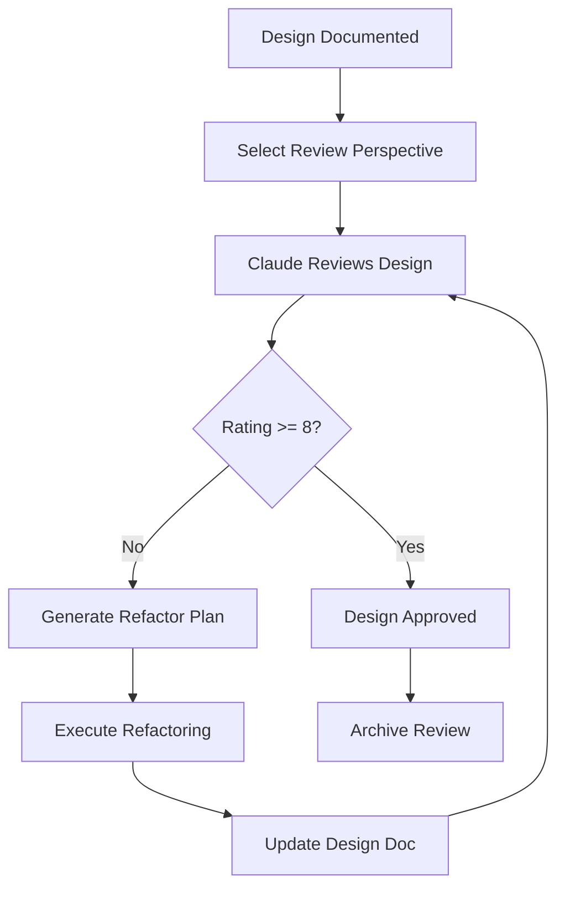

# Workflow 4: Design Review

## Purpose
Systematically evaluate design quality from multiple expert perspectives, ensuring code meets high standards before proceeding.

## When to Use
- After completing design documentation
- Before merging major features
- When uncertain about architectural decisions
- After significant refactoring
- As a learning tool for best practices

## The Workflow



## Step-by-Step Process

### Step 1: Prepare Design for Review
Ensure your design document is complete:
- Architecture documented
- Implementation details included
- API surface defined
- Trade-offs explained

### Step 2: Select Review Perspective
Choose perspective based on current concerns:
- **Language Expert**: For type safety and API design
- **Performance Engineer**: For optimization opportunities
- **Security Architect**: For vulnerability assessment
- **Maintainability Expert**: For long-term sustainability
- **Domain Expert**: For business logic correctness

### Step 3: Request Review
```markdown
"Review docs/designs/[feature]-design.md as a [Perspective]"
```

### Step 4: Receive Rating and Feedback
Claude provides:
- Rating from 1-10
- Specific strengths
- Areas for improvement
- Critical issues (if any)
- Refactoring checklist

### Step 5: Refactor if Needed
If rating < 8:
1. Create refactoring plan
2. Execute changes
3. Update design document
4. Request re-review

### Step 6: Archive Review
Save reviews for:
- Pattern recognition
- Team learning
- Quality metrics

## Review Perspectives

### Language Expert Perspective

```markdown
"Review this design as a professional software developer with 10+ years experience in [language]."

Focus Areas:
1. Type safety and proper language features usage
2. Avoiding 'any' types and ensuring strong typing
3. Proper use of generics, unions, and discriminated unions
4. Interface design and API contracts
5. Null safety and error handling
6. Type inference optimization
7. Declaration file quality

Review Criteria:
- No implicit 'any' types
- Proper use of strict mode features
- Effective use of utility types
- Clear type hierarchies
- Proper variance in generic types
- Appropriate use of const assertions
- Type guards and narrowing

Red Flags:
- Type assertions without validation
- Overuse of optional properties
- Missing discriminated unions
- Incorrect variance annotations
- Type-unsafe array operations
- Missing readonly modifiers
```

### Performance Engineer Perspective

```markdown
"Review this design as a performance engineer focused on optimization."

Focus Areas:
1. Algorithm complexity and data structures
2. Memory usage and allocation patterns
3. Caching strategies and memoization
4. Lazy loading and code splitting
5. Bundle size and tree shaking
6. Hot path optimization
7. Resource pooling and reuse

Review Criteria:
- O(n) or better for common operations
- Minimal memory allocations in loops
- Effective caching where appropriate
- No memory leaks
- Optimized bundle size
- Efficient data structures
- Proper async/await usage

Red Flags:
- Nested loops without bounds
- Unbounded cache growth
- Synchronous I/O in hot paths
- Large object cloning
- Repeated expensive computations
- Missing pagination/streaming
- Blocking operations
```

### Security Architect Perspective

```markdown
"Review this design as a security architect."

Focus Areas:
1. Input validation and sanitization
2. Authentication and authorization patterns
3. Data exposure and information leakage
4. Injection attack vectors (XSS, SQL, Command)
5. Secure defaults and fail-safe behaviors
6. Sensitive data handling
7. Dependency vulnerabilities

Review Criteria:
- All inputs validated
- Principle of least privilege
- Defense in depth
- Secure by default
- No sensitive data in logs
- Proper error handling
- Safe serialization

Red Flags:
- Unvalidated user input
- Dynamic code execution
- Sensitive data exposure
- Missing authorization checks
- Unsafe deserialization
- Hardcoded secrets
- Verbose error messages
```

### Maintainability Expert Perspective

```markdown
"Review this design as a senior engineer focused on long-term maintainability."

Focus Areas:
1. Code organization and modularity
2. Naming clarity and consistency
3. Documentation completeness
4. Test coverage and testability
5. Dependency management
6. Future extensibility
7. Technical debt assessment

Review Criteria:
- Single responsibility principle
- Clear separation of concerns
- Consistent naming conventions
- Self-documenting code
- High cohesion, low coupling
- Comprehensive test coverage
- Clear extension points

Red Flags:
- God objects/modules
- Circular dependencies
- Magic numbers/strings
- Complex conditional logic
- Missing abstractions
- Tight coupling
- Untestable design
```

### Domain Expert Perspective

```markdown
"Review this design as a [domain] expert."

For Interactive Fiction:
1. Domain model accuracy
2. Flexibility for story authors
3. Parser capabilities and limitations
4. Performance for text processing
5. Extensibility for new commands
6. Player experience considerations
7. Content creation workflow

Review Criteria:
- Accurate domain modeling
- Intuitive author API
- Flexible command system
- Efficient text processing
- Clear extension mechanisms
- Good error messages
- Debugging capabilities

Red Flags:
- Inflexible grammar system
- Poor error recovery
- Limited command vocabulary
- No disambiguation support
- Missing state management
- Poor performance on common operations
```

## Review Response Format

```markdown
# Design Review: [Feature Name]
Reviewer Perspective: [Perspective Used]
Date: YYYY-MM-DD
Version Reviewed: X.X

## Overall Rating: [X/10]

## Summary
[2-3 sentence overview of the design quality from this perspective]

## Strengths ✅

### Strength 1: [Category]
**What**: [Specific aspect done well]
**Example**:
```javascript
// Example of good practice
interface WellDesignedAPI {
  // Clear, type-safe interface
}
```
**Impact**: [Why this is valuable]

### Strength 2: [Category]
**What**: [Specific aspect done well]
**Why it's good**: [Explanation]

### Strength 3: [Category]
**What**: [Specific aspect done well]
**Benefit**: [Positive outcome]

## Areas for Improvement ⚠️

### Issue 1: [Issue Category] (Priority: High/Medium/Low)
**Current Implementation**:
```javascript
// Current problematic code
function current(): any {
  // Issues here
}
```

**Problem**: [What's wrong with this approach]

**Suggested Improvement**:
```javascript
// Improved version
function improved<T>(): Result<T> {
  // Better approach
}
```

**Rationale**: [Why this is better]

### Issue 2: [Issue Category] (Priority: High/Medium/Low)
**Location**: `src/file.ts:42`
**Current**: [Current approach]
**Issue**: [What's problematic]
**Solution**: [How to fix]
**Impact if not fixed**: [Consequences]

## Critical Issues 🔴

### Critical Issue 1: [Security/Performance/Correctness Issue]
**Severity**: Critical
**Location**: [Where in the code]

**Description**:
[Detailed explanation of the critical issue]

**Current Code**:
```javascript
// Problematic code that must be fixed
```

**Required Fix**:
```javascript
// Corrected version
```

**Why Critical**:
- [Impact 1]
- [Impact 2]
- [Potential consequences]

## Optimization Opportunities 💡

### Opportunity 1: [Optimization Type]
**Current Performance**: [Metric]
**Potential Improvement**: [Target metric]
**How**: [Implementation approach]
**Effort**: Low/Medium/High
**Impact**: Low/Medium/High

### Opportunity 2: [Optimization Type]
**Suggestion**: [What could be improved]
**Benefit**: [Expected outcome]
**Trade-off**: [What you give up]

## Refactoring Checklist

### Priority 1: Must Fix (for rating >= 8)
- [ ] Fix critical issue: [Specific issue]
- [ ] Address security concern: [Specific concern]
- [ ] Resolve type safety problem: [Specific problem]

### Priority 2: Should Fix
- [ ] Improve: [Specific improvement]
- [ ] Refactor: [Specific refactoring]
- [ ] Optimize: [Specific optimization]

### Priority 3: Nice to Have
- [ ] Polish: [Enhancement]
- [ ] Document: [What needs docs]
- [ ] Add: [Additional feature]

## Code Quality Metrics

| Metric | Current | Target | Status |
|--------|---------|--------|--------|
| Type Coverage | 75% | 95% | ⚠️ Needs Work |
| Cyclomatic Complexity | 12 | <10 | ⚠️ Needs Work |
| Test Coverage | 85% | 80% | ✅ Good |
| Bundle Size | 150KB | <200KB | ✅ Good |
| Performance | 50ms | <100ms | ✅ Good |

## Architectural Observations

### Positive Patterns
- ✅ Good use of [pattern]
- ✅ Clear separation between [components]
- ✅ Effective [technique]

### Anti-patterns Detected
- ❌ [Anti-pattern name]: [Where and why it's bad]
- ❌ [Anti-pattern name]: [Where and why it's bad]

## Recommendations

### Immediate Actions
1. **Fix**: [Most critical issue]
2. **Refactor**: [Most impactful improvement]
3. **Test**: [What needs test coverage]

### Short Term (This Sprint)
1. [Improvement 1]
2. [Improvement 2]

### Long Term (Technical Debt)
1. [Larger refactoring]
2. [Architectural improvement]

## Learning Points

### What's Done Well
- Lesson: [What to repeat in future designs]
- Pattern: [Reusable pattern identified]

### What to Avoid
- Lesson: [What not to do]
- Anti-pattern: [What to watch for]

## Re-review Focus Areas

If rating < 8, focus re-review on:
1. [Specific area that needs most work]
2. [Second priority area]
3. [Third priority area]

## Comparison to Best Practices

| Best Practice | Implementation | Status |
|--------------|----------------|--------|
| SOLID Principles | Partially followed | ⚠️ |
| DRY | Well implemented | ✅ |
| KISS | Could be simpler | ⚠️ |
| YAGNI | Good focus | ✅ |

## Final Notes

[Any additional observations, suggestions, or context that doesn't fit above categories]
```

## Refactoring Workflow

### Creating a Refactoring Plan

```markdown
# Refactoring Plan: [Feature Name]
Based on: [Perspective] Review
Date: YYYY-MM-DD
Current Rating: X/10
Target Rating: 8+

## Review Summary
[Key issues identified in review]

## Refactoring Phases

### Phase 1: Critical Fixes [~X hours]
**Goal**: Address all critical issues

Tasks:
1. [ ] Fix: [Critical issue 1]
   - File: `src/file.ts`
   - Change: [Specific change]
   - Test: [How to verify]

2. [ ] Fix: [Critical issue 2]
   - File: `src/file2.ts`
   - Change: [Specific change]
   - Test: [How to verify]

**Success Criteria**:
- No critical issues remain
- All tests still pass
- No new type/compilation errors

### Phase 2: Major Improvements [~X hours]
**Goal**: Address high-priority improvements

Tasks:
1. [ ] Improve: [Issue 1]
2. [ ] Refactor: [Issue 2]
3. [ ] Optimize: [Issue 3]

**Success Criteria**:
- Code quality metrics improved
- Performance targets met
- Type coverage increased

### Phase 3: Polish [~X hours]
**Goal**: Nice-to-have improvements

Tasks:
1. [ ] Enhancement: [Improvement 1]
2. [ ] Documentation: [Doc update]

## Risk Assessment

| Risk | Mitigation |
|------|------------|
| Breaking changes | Comprehensive test suite |
| Performance regression | Benchmark before/after |
| API compatibility | Maintain backward compatibility |

## Validation Plan

1. Run all existing tests
2. Add new tests for refactored code
3. Performance benchmark
4. Manual testing of key flows
5. Update design documentation
6. Request re-review

## Rollback Plan

If refactoring causes issues:
1. Revert to commit: [commit hash]
2. Document issues encountered
3. Create alternative approach
```

## Best Practices

### 1. Review Early and Often
✅ Review after each major phase
❌ Wait until everything is "done"

### 2. Use Different Perspectives
✅ Language expert review, then Performance review
❌ Only one type of review

### 3. Take Low Ratings Seriously
✅ Refactor until rating >= 8
❌ Ignore feedback if "it works"

### 4. Document Review Outcomes
✅ Save all reviews for learning
❌ Discard after refactoring

### 5. Learn from Patterns
✅ Extract common issues into guidelines
❌ Make the same mistakes repeatedly

## Common Review Findings

### Language Expert Reviews Often Find
- Missing type parameters
- Unsafe type assertions
- Implicit any types
- Poor error handling types
- Missing readonly modifiers

### Performance Reviews Often Find
- Unnecessary re-computation
- Missing caching opportunities
- Inefficient data structures
- Synchronous operations that could be async
- Large bundle sizes

### Security Reviews Often Find
- Unvalidated inputs
- Missing authorization checks
- Sensitive data in logs
- Injection vulnerabilities
- Unsafe dependencies

### Maintainability Reviews Often Find
- Complex conditional logic
- Circular dependencies
- Missing abstractions
- Poor naming conventions
- Insufficient documentation

## Metrics to Track

### Review Metrics
- **Initial Rating Distribution**: Track improvement over time
- **Refactoring Cycles**: How many reviews to reach 8+
- **Common Issues**: What issues appear repeatedly
- **Time Investment**: Review and refactoring time

### Quality Trends
- Average initial rating: [Track over time]
- Average final rating: [Should approach 8+]
- Refactoring success rate: [% reaching 8+]
- Issue patterns: [Common problems]

## Integration with Other Workflows

### After Planning Mode
- Initial implementation follows plan
- Design documentation captures reality
- Review ensures quality

### Before Session Context
- Complete review cycle
- Document outcomes
- Note any pending refactoring

### With Git Workflow
- Refactoring in feature branch
- Reviews inform PR description
- Quality gates before merge

## Advanced Techniques

### Multi-Perspective Review
```markdown
1. Language Expert review → Fix type issues
2. Performance review → Optimize
3. Security review → Harden
4. Final maintainability review → Polish
```

### Incremental Review
Review components as completed rather than waiting for entire feature.

### Peer Review Integration
Use Claude review before human peer review to catch obvious issues.

### Review-Driven Development
Write design first, get review, then implement with feedback in mind.

## Next Steps

1. Complete your [Design Documentation](workflow-3-design-documentation.md)
2. Choose appropriate review perspective
3. Request review from Claude
4. Create refactoring plan if needed
5. Iterate until rating >= 8
6. Document lessons learned

Remember: High standards early save debugging time later!