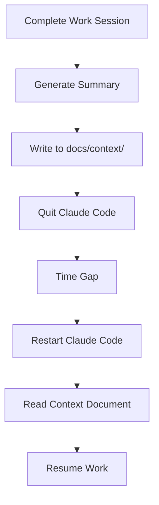

# Workflow 5: Session Context

## Purpose
Preserve complete working context between Claude Code sessions, enabling seamless continuation of work across time gaps.

## When to Use
- At the end of every work session
- Before switching to a different task
- When you might not return for several days
- After completing significant work
- When encountering blocking issues

## The Workflow



## Step-by-Step Process

### Step 1: Complete Work Session
Before ending your session, ensure you're at a logical stopping point:
- Tests are running (or failing in a known way)
- Code is committed or changes are saved
- You understand what needs to happen next

### Step 2: Generate Session Summary
Ask Claude to create a comprehensive summary:
```markdown
"Create a session context document for today's work"
```

### Step 3: Save to Context Directory
Save as: `docs/context/session-YYYYMMDD-HHMM.md`
- Use 24-hour time format
- Include date and time for easy sorting
- Keep all sessions for historical reference

### Step 4: Quit Claude Code
Completely exit Claude Code to simulate real session boundaries.

### Step 5: Restart and Resume
When returning:
```markdown
"Read docs/context/session-20241228-1430.md to understand where we left off"
```

## Session Context Template

```markdown
# Session Context: YYYY-MM-DD HH:MM

## Session Summary
[2-3 sentences describing the session's purpose and overall outcome. 
What were you trying to accomplish? How far did you get?]

## Work Completed
- ✅ **[Task 1]**: [Specific outcome and any important details]
- ✅ **[Task 2]**: [What was achieved and how]
- 🔄 **[In Progress]**: [Current state, what's done, what remains]
- ❌ **[Blocked/Failed]**: [What was attempted, why it failed, what to try next]

## Key Decisions & Discoveries

### Decisions Made
- **[Decision Category]**: [What was decided and rationale]
  - Example: "Use factory pattern instead of builder"
  - Rationale: "Simpler API for our use case"

### Important Discoveries  
- **[Discovery Type]**: [What you learned that affects the work]
  - Example: "The parser requires vocabulary to be loaded before initialization"
  - Impact: "Need to refactor initialization sequence"

### Patterns That Worked
- **[Pattern Name]**: [Reusable approach that succeeded]
  - Example: "Test-first debugging"
  - How: "Write failing test that reproduces bug, then fix"

### Issues Encountered
- **[Issue Type]**: [Problem that needs attention]
  - Example: "Circular dependency between modules"
  - Next step: "Investigate dependency injection solution"

## Modified Files

### Critical Changes
**High-impact modifications that affect system behavior:**

- `packages/[package]/src/[file1].ts`:
  - **What**: [Specific change made]
  - **Why**: [Reason for change]
  - **Impact**: [How this affects other parts]

- `packages/[package]/src/[file2].ts`:
  - **What**: [Specific change made]
  - **Why**: [Reason for change]
  - **Impact**: [How this affects other parts]

### Supporting Changes
**Lower-impact modifications:**
- `path/to/file3.ts`: [Brief description]
- `path/to/file4.md`: [Documentation update]

## Current State

### Git Status
```bash
Branch: feature/[branch-name]
Ahead of main by: 4 commits
Modified files: 8
Staged files: 5
Untracked files: 2

Last 3 commits:
- abc1234: feat: implement new validation logic
- def5678: test: add coverage for edge cases
- ghi9012: refactor: extract common patterns
```

### Build & Test Status
```bash
Build: ✅ Passing | ⚠️ Warnings | ❌ Failing
- Package core: ✅ Built successfully
- Package utils: ⚠️ Built with warnings (unused var)

Tests: ✅ All passing | ⚠️ Some failing | ❌ Broken
- Total: 142 tests
- Passing: 140
- Failing: 2
- Coverage: 78%

Type Check: ✅ Clean | ⚠️ Errors
- 0 errors, 3 warnings

Lint: ✅ Clean | ⚠️ Issues
- 2 style warnings (line length)
```

## Active Problems

### Problem 1: [Test Failure]
**File**: `packages/parser/test/vocabulary.test.js`
**Test**: "should load dynamic vocabulary"
**Error**: 
```
Expected: vocabulary to contain 'custom-verb'
Received: undefined
```
**Investigation**:
- Checked: Import paths are correct
- Checked: File exists at runtime
- Suspect: Async loading race condition
**Next Step**: Add await to vocabulary load call

### Problem 2: [Type Error]
**File**: `packages/engine/src/runtime.ts:142`
**Error**:
```javascript
Type 'EventEmitter<GameEvents>' is not assignable to type 'EventEmitter<BaseEvents>'
```
**Attempted Solutions**:
1. Tried extending interface - didn't work
2. Tried type assertion - hides real issue
**Next Step**: Investigate generic constraints

## Next Session Starting Point

### Immediate Action
1. **First**: Run `pnpm test` to see current state
2. **Then**: Check if Problem 1 still exists after last commit
3. **Focus**: Fix the two failing tests before continuing

### Continue From
- **Checklist**: `docs/work/parser-phase2-checklist.md`
- **Current Item**: Section 3, Task 4 (Wire up dynamic loading)
- **Time Spent on Phase**: 3.5 hours of estimated 5 hours

### Upcoming Work
After fixing current issues:
1. Complete Phase 2 checklist (1.5 hours remaining)
2. Begin Phase 3: Polish and documentation
3. Request design review from language expert perspective

## Important Context

### Constraints & Decisions
- **Must Maintain**: Backward compatibility with v2.x API
- **Architecture Decision**: Using event sourcing for game state
- **Performance Target**: Parser init must be <50ms
- **Review Required**: API changes need team approval

### Dependencies
- **Waiting On**: 
  - ADR-049 approval for state management approach
  - Team decision on error handling strategy
- **Blocks**: 
  - Can't refactor error handling until decision made
  - State persistence work blocked by ADR

### Environment Notes
- **Node Version**: Using 18.17.0 (nvm use 18)
- **Special Flags**: DEBUG=app:* for verbose logging
- **Known Issues**: Hot reload not working with symlinks

## Command Reference

### Frequently Used Commands
```bash
# Run specific test that's been failing
npm run test:parser vocabulary

# Build with source maps for debugging  
pnpm build --sourcemap

# Run with debug logging
DEBUG=app:* npm test

# Check for circular dependencies
pnpm madge --circular packages/*/src

# Quick typecheck without build
pnpm tsc --noEmit
```

### Useful Aliases Created
```bash
alias pt='pnpm test'
alias pb='pnpm build'
alias ptc='pnpm typecheck'
```

## Questions for Next Session

### Technical Questions
- [ ] Should we make EventEmitter contravariant in its type parameter?
- [ ] Is the factory pattern the right choice for parser extensions?
- [ ] How should we handle async initialization in constructors?

### Product Questions  
- [ ] Do we need backward compatibility with v1.x?
- [ ] What's the performance budget for parser initialization?
- [ ] Should dynamic vocabulary support hot reloading?

### Process Questions
- [ ] When is the ADR review meeting?
- [ ] Who needs to approve API changes?
- [ ] What's the target date for this feature?

## Session Metrics

### Time Tracking
- **Session Duration**: 2.5 hours
- **Planned Work**: 3 hours
- **Actual Progress**: 80% of planned

### Code Metrics
- **Lines Added**: ~400
- **Lines Removed**: ~150  
- **Files Modified**: 12
- **Commits Made**: 4

### Test Metrics
- **Tests Added**: 8
- **Tests Fixed**: 6
- **Coverage Change**: 76% → 78% (+2%)

### Review Items
- **Decisions Made**: 3
- **Decisions Deferred**: 2
- **Blockers Encountered**: 2
- **Blockers Resolved**: 1

## Notes & Observations

### What Worked Well
- Test-first approach caught edge cases early
- Breaking changes into small commits made debugging easier
- Using strict type checking revealed hidden issues

### What Could Improve
- Need better error messages in test assertions
- Should have checked for circular dependencies earlier
- Documentation updates should happen alongside code changes

### Patterns to Remember
- Always await async operations in tests
- Check for circular dependencies when refactoring modules
- Use debug logging liberally when investigating issues

### Lessons Learned
- The vocabulary system is more complex than anticipated
- Event typing requires careful planning
- Factory pattern works better than builder for our use case
```

## Best Practices

### 1. Write Immediately
✅ Write context before closing Claude Code
❌ Try to recreate context from memory later

### 2. Be Specific About Problems
✅ "Test failing: Expected 'foo', got undefined at line 42"
❌ "Some tests are failing"

### 3. Include Exact Commands
✅ `npm run test:parser vocabulary.test.js`
❌ "Run the parser tests"

### 4. Document Partial Work
✅ "Refactored 3 of 5 modules, module4 next"
❌ "Did some refactoring"

### 5. Track Time Invested
✅ "Spent 2.5 hours, Phase 2 is 70% complete"
❌ "Worked on Phase 2"

## Common Patterns

### Pattern 1: Daily Development Session
```markdown
Morning session → Context doc → Lunch break → Read context → Continue
```

### Pattern 2: Weekend Project
```markdown
Friday evening → Context doc → Monday morning → Read context → Resume
```

### Pattern 3: Debugging Session
```markdown
Investigate issue → Document findings → Context doc → Research → Apply fix
```

### Pattern 4: Feature Development
```markdown
Implement phase → Context doc → Review → Address feedback → Continue
```

## Advanced Techniques

### Context Chaining
Link related sessions:
```markdown
## Previous Context
- See: `docs/context/session-20241227-1600.md`
- Continuation of: Parser refactoring sprint
```

### Problem Tracking
Maintain problem continuity:
```markdown
## Ongoing Issues (Day 3)
- Issue #1: First seen session-20241226-1000.md
- Issue #2: Resolved in session-20241227-1600.md
```

### Metric Trends
Track progress over time:
```markdown
## Progress Tracking
- Day 1: 20% complete (4 hours)
- Day 2: 50% complete (3 hours)  
- Day 3: 75% complete (2.5 hours)
- Velocity improving as familiarity increases
```

## Troubleshooting

### Issue: Context Too Long
**Solution**: Focus on problems, decisions, and next steps. Archive completed work details.

### Issue: Lost Between Sessions
**Solution**: Always include "Next Session Starting Point" with specific first action.

### Issue: Repeated Problems
**Solution**: Create a "Known Issues" document that persists across sessions.

### Issue: Context Conflicts
**Solution**: If multiple people work on same code, prefix context files with initials.

## Examples from Real Sessions

### Example 1: Bug Fix Session
```markdown
Session focused on fixing parser memory leak.
Found issue in vocabulary cache (never cleared).
Solution implemented but needs performance testing.
Next: Run benchmarks and verify fix.
```

### Example 2: Feature Implementation
```markdown
Completed Phase 1 of event system refactor.
All tests passing, types are clean.
Discovered need for event replay functionality.
Next: Start Phase 2 with replay implementation.
```

### Example 3: Blocked Session
```markdown
Hit circular dependency issue between parser and engine.
Tried 3 approaches, none worked cleanly.
Need architectural decision before proceeding.
Next: Document options in ADR format for review.
```

## Integration with Other Workflows

### Before Planning Mode
Read last context to understand current state before planning next feature.

### After Design Review
Document review feedback in context for next session's refactoring.

### During Implementation
Update context whenever you hit a significant milestone or blocker.

## Metrics to Track

- **Context Write Time**: How long to create (target: <10 minutes)
- **Resume Time**: How long to get productive after reading (target: <5 minutes)
- **Context Accuracy**: How often you need to investigate beyond context (target: <10%)
- **Session Continuity**: How well work flows between sessions (subjective quality)

## Next Steps

1. Create your first session context at the end of today's work
2. Practice the full cycle: Write → Quit → Restart → Read → Resume
3. Refine your template based on what information you actually need
4. Build a rhythm of consistent context documentation

Remember: Your future self will thank you for clear, detailed context!