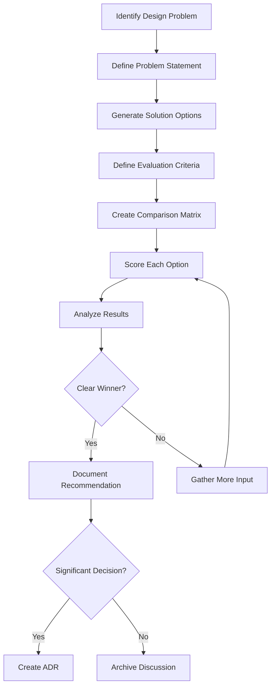

# Workflow: Design Discussion

## Purpose
Systematically explore and evaluate multiple solutions to design problems using structured analysis and comparison techniques, documenting the discussion for future reference.

## When to Use
- Multiple valid approaches exist
- Trade-offs are not immediately clear
- Team input needed for decision
- Solution impacts multiple areas
- Exploring options before committing
- Need comparative analysis

## The Workflow



## Step-by-Step Process

### Step 1: Identify Design Problem
Recognize when a design discussion is needed:
- Multiple implementation paths available
- Performance vs maintainability trade-offs
- Build vs buy decisions
- Technology selection
- API design choices
- Data structure decisions

### Step 2: Define Problem Statement
Clearly articulate what needs to be solved:
```markdown
## Problem Statement
[1-2 paragraphs describing the problem]

### Context
- Current situation: [what exists now]
- Desired outcome: [what we want]
- Constraints: [limitations]

### Success Criteria
What would make a solution successful:
- [Criterion 1]
- [Criterion 2]
- [Criterion 3]
```

### Step 3: Generate Solution Options
Brainstorm multiple approaches:
- Don't filter too early
- Include "do nothing" option if valid
- Consider hybrid approaches
- Think outside initial constraints

### Step 4: Define Evaluation Criteria
Identify what matters for comparison:
- Performance
- Maintainability
- Cost (time/money)
- Complexity
- Risk
- Scalability
- Security
- User experience

### Step 5: Create Comparison Matrix
Build structured comparison using Harvey Balls or scores.

### Step 6: Score Each Option
Evaluate systematically against criteria.

### Step 7: Analyze Results
Look for patterns, clear winners, or need for more information.

### Step 8: Document Outcome
Create design discussion document and potentially an ADR.

## Design Discussion Template

```markdown
# Design Discussion DD-[000]: [Title]

## Status
[Active | Resolved | Superseded | Abandoned]

## Date
Created: YYYY-MM-DD
Updated: YYYY-MM-DD

## Participants
- [Name/Role]
- [Name/Role]

## Problem Statement

### Context
[Background and current situation]

### The Problem
[Clear description of what needs to be solved]

### Constraints
- [Hard constraint 1]
- [Hard constraint 2]
- [Soft constraint/preference]

### Success Criteria
A solution should:
- [Criterion 1]
- [Criterion 2]
- [Criterion 3]

## Options Considered

### Option A: [Name]
**Description**: [1-2 paragraphs explaining the approach]

**Implementation Sketch**:
```javascript
// Pseudo-code or interface example
class OptionA {
  // Key aspects
}
```

**Pros**:
- [Advantage 1]
- [Advantage 2]

**Cons**:
- [Disadvantage 1]
- [Disadvantage 2]

**Risks**:
- [Risk and mitigation]

**Estimated Effort**: [S/M/L or hours/days]

### Option B: [Name]
**Description**: [1-2 paragraphs explaining the approach]

**Implementation Sketch**:
```javascript
// Pseudo-code or interface example
```

**Pros**:
- [Advantage 1]
- [Advantage 2]

**Cons**:
- [Disadvantage 1]
- [Disadvantage 2]

**Risks**:
- [Risk and mitigation]

**Estimated Effort**: [S/M/L or hours/days]

### Option C: [Name]
[Similar structure as above]

## Evaluation Criteria

### Criteria Definitions
1. **Performance**: Response time and resource usage
2. **Maintainability**: Ease of understanding and modification
3. **Implementation Complexity**: Difficulty to build initially
4. **Operational Complexity**: Difficulty to run and monitor
5. **Flexibility**: Ability to adapt to future changes
6. **Cost**: Development time and resources
7. **Risk**: Likelihood of problems or failure

### Weighting
- Performance: 30%
- Maintainability: 25%
- Flexibility: 20%
- Implementation Complexity: 15%
- Other: 10%

## Comparison Matrix

### Harvey Ball Ratings
- ⬤ Excellent (5 points)
- ◕ Good (4 points)
- ◑ Fair (3 points)
- ◔ Poor (2 points)
- ○ Very Poor (1 point)

| Criteria | Weight | Option A | Option B | Option C |
|----------|--------|----------|----------|----------|
| Performance | 30% | ◕ (4) | ⬤ (5) | ◑ (3) |
| Maintainability | 25% | ⬤ (5) | ◑ (3) | ◕ (4) |
| Implementation Complexity | 15% | ⬤ (5) | ◔ (2) | ◑ (3) |
| Operational Complexity | 10% | ◕ (4) | ◑ (3) | ⬤ (5) |
| Flexibility | 20% | ◑ (3) | ◕ (4) | ⬤ (5) |
| **Weighted Total** | **100%** | **4.15** | **3.65** | **3.95** |

### Detailed Scoring Breakdown
```
Option A: (4×0.30) + (5×0.25) + (5×0.15) + (4×0.10) + (3×0.20) = 4.15
Option B: (5×0.30) + (3×0.25) + (2×0.15) + (3×0.10) + (4×0.20) = 3.65
Option C: (3×0.30) + (4×0.25) + (3×0.15) + (5×0.10) + (5×0.20) = 3.95
```

## Scenario Analysis

### Scenario 1: High Load
| Aspect | Option A | Option B | Option C |
|--------|----------|----------|----------|
| Behavior | Degrades gracefully | Scales well | Requires manual intervention |
| Risk | Medium | Low | High |
| Mitigation | Add caching | None needed | Pre-scaling required |

### Scenario 2: Rapid Changes
| Aspect | Option A | Option B | Option C |
|--------|----------|----------|----------|
| Adaptability | Good | Limited | Excellent |
| Effort | Low | High | Low |
| Risk | Low | High | Low |

### Scenario 3: Limited Resources
| Aspect | Option A | Option B | Option C |
|--------|----------|----------|----------|
| Feasibility | Yes | No | Yes |
| Compromises | None | Feature reduction | Performance impact |
| Timeline | On track | Delayed | On track |

## Recommendation

Based on the analysis:

**Recommended: Option A**

**Rationale**:
- Highest weighted score (4.15)
- Best balance of maintainability and performance
- Lower implementation risk
- Acceptable trade-offs

**Runner-up: Option C**
- Consider if flexibility becomes more important
- Better for long-term evolution

**Conditions for Reconsideration**:
- If performance requirements exceed X threshold → Option B
- If timeline extends beyond Y weeks → Option C
- If team composition changes → Re-evaluate

## Decision Outcome

### Decision Made
[Date]: [What was decided]

### Rationale for Final Choice
[Why this option was selected, any modifications from original]

### Action Items
- [ ] Create ADR if needed
- [ ] Update technical documentation
- [ ] Communicate to team
- [ ] Begin implementation

## Appendix

### Additional Data
[Performance benchmarks, research links, prototypes]

### Meeting Notes
[Key points from discussions]

### References
- [Link to related ADR]
- [Link to requirements]
- [Link to prototypes]
```

## Evaluation Techniques

### Harvey Ball Method
Visual representation of qualitative assessments:
```
⬤ Excellent  - Fully meets/exceeds requirements
◕ Good       - Meets requirements well
◑ Fair       - Adequately meets requirements
◔ Poor       - Barely meets requirements
○ Very Poor  - Does not meet requirements
```

### Numeric Scoring
Use 1-5 or 1-10 scales:
```markdown
| Criteria | Option A | Option B | Option C |
|----------|----------|----------|----------|
| Performance | 8/10 | 10/10 | 6/10 |
| Maintainability | 9/10 | 5/10 | 7/10 |
| Total | 17/20 | 15/20 | 13/20 |
```

### Weighted Scoring
Apply importance weights to criteria:
```markdown
Score = Σ(Rating × Weight) for all criteria
```

### SWOT Analysis
For each option:
```markdown
| Strengths | Weaknesses |
|-----------|------------|
| [List] | [List] |

| Opportunities | Threats |
|---------------|---------|
| [List] | [List] |
```

### Risk Matrix
```markdown
| Risk | Probability | Impact | Score |
|------|------------|--------|-------|
| [Risk 1] | High (3) | High (3) | 9 |
| [Risk 2] | Low (1) | High (3) | 3 |
```

## Common Discussion Topics

### Architecture Decisions
- Monolith vs microservices
- Sync vs async processing
- Database selection
- Caching strategies
- API design (REST/GraphQL/gRPC)

### Technology Selection
- Framework comparison
- Library evaluation
- Build tool selection
- Testing framework choice
- Deployment platform

### Design Patterns
- Factory vs builder
- Observer vs pub/sub
- Repository vs active record
- Strategy vs template method

### Performance Trade-offs
- Memory vs computation
- Latency vs throughput
- Consistency vs availability
- Normalization vs denormalization

### Process Decisions
- CI/CD pipeline design
- Branching strategies
- Release processes
- Code review practices

## Integration with Other Workflows

### From Design Mode
When Design Mode reveals multiple viable options:
1. Create design discussion document
2. Conduct systematic comparison
3. Make informed decision
4. Potentially create ADR

### To ADR Creation
When discussion yields significant decision:
1. Use discussion as input for ADR context
2. Reference discussion document in ADR
3. Summarize evaluation in ADR rationale

### With Team Collaboration
1. Share discussion document for input
2. Conduct review sessions
3. Update scores based on feedback
4. Document consensus

## Best Practices

### 1. Define Clear Criteria
✅ Specific, measurable criteria
❌ Vague qualities like "better"

### 2. Include All Stakeholders
✅ Get input from those affected
❌ Decide in isolation

### 3. Document Assumptions
✅ State what you're assuming
❌ Leave assumptions implicit

### 4. Time-box Discussion
✅ Set deadline for decision
❌ Endless analysis paralysis

### 5. Consider Future Scenarios
✅ How options handle change
❌ Only current requirements

## Anti-patterns to Avoid

### Anti-pattern 1: Predetermined Outcome
❌ Going through motions to justify pre-made decision
✅ Genuine evaluation of options

### Anti-pattern 2: Perfect Information
❌ Waiting for all possible data
✅ Decide with available information

### Anti-pattern 3: Too Many Options
❌ Comparing 10+ alternatives
✅ Focus on 3-5 viable options

### Anti-pattern 4: Ignoring Constraints
❌ Ideal solutions ignoring reality
✅ Work within actual constraints

### Anti-pattern 5: No Follow-through
❌ Decision made but not communicated
✅ Clear action items and communication

## Example Design Discussions

### Example 1: State Management
```markdown
# DD-001: State Management Approach

## Problem
Need to manage complex application state across components.

## Options
A. Redux - Centralized store
B. Context API - Built-in React solution  
C. MobX - Observable state

## Comparison
| Criteria | Redux | Context | MobX |
|----------|-------|---------|------|
| Learning Curve | ◔ | ⬤ | ◑ |
| Performance | ⬤ | ◑ | ◕ |
| Debugging | ⬤ | ◔ | ◕ |

## Recommendation
Redux for predictability and tooling.
```

### Example 2: API Protocol
```markdown
# DD-002: API Communication Protocol

## Problem
Choose protocol for service communication.

## Options
A. REST - Standard HTTP/JSON
B. GraphQL - Query language
C. gRPC - Binary protocol

## Weighted Comparison
Performance (40%): gRPC > REST > GraphQL
Simplicity (30%): REST > GraphQL > gRPC
Flexibility (30%): GraphQL > REST > gRPC

## Recommendation
REST for simplicity, consider GraphQL for v2.
```

## Metrics to Track

- **Decision Speed**: Time from problem to decision
- **Decision Changes**: How often decisions reversed
- **Participation Rate**: Stakeholder involvement
- **Implementation Success**: Did chosen option work?
- **Prediction Accuracy**: Did scenarios materialize?

## Next Steps

1. Identify current design questions in your project
2. Create design discussion document
3. Define evaluation criteria
4. Build comparison matrix
5. Gather stakeholder input
6. Make data-driven decision
7. Document outcome and rationale

Remember: Design discussions provide structured thinking and documentation for complex decisions, even when they don't rise to the level of an ADR!