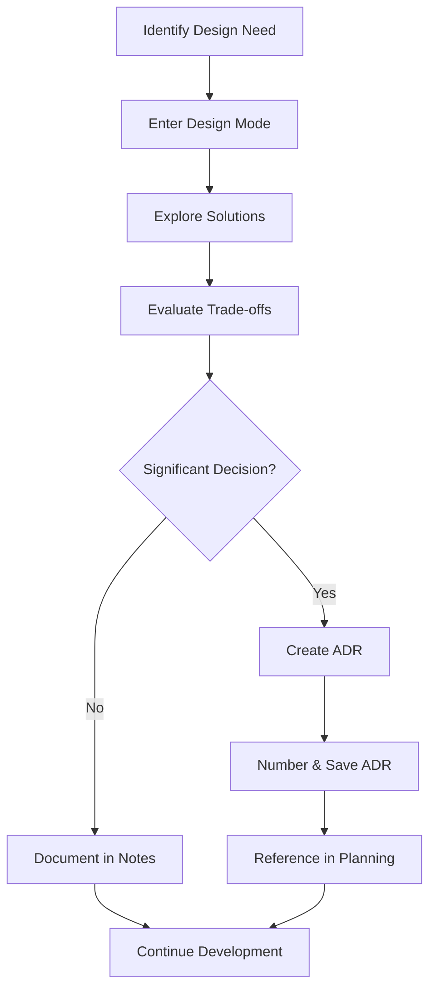
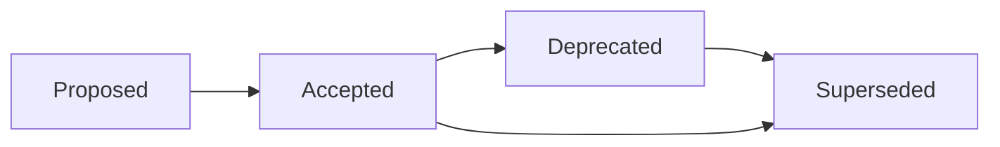

# Workflow: Design Mode & Architecture Decision Records (ADRs)

## Purpose
Explore architectural solutions, evaluate trade-offs, and document significant technical decisions that shape the project's future.

## When to Use
- When facing architectural crossroads
- Before implementing complex features
- When multiple valid solutions exist
- During technical spike investigations
- When team consensus is needed
- To document why alternatives were rejected

## The Workflow



## Design Mode vs Planning Mode

| Aspect | Design Mode | Planning Mode |
|--------|------------|---------------|
| **Focus** | Architecture & decisions | Implementation steps |
| **Output** | ADRs, design docs | Checklists, phases |
| **Timing** | Any time, exploratory | Before implementation |
| **Scope** | System-wide impacts | Feature-specific tasks |
| **Duration** | Variable, can span days | Usually single session |

## Step-by-Step Process

### Step 1: Recognize Design Need

Common triggers:
- Performance bottleneck requiring architectural change
- Competing implementation approaches
- Technology selection decision
- Breaking change consideration
- Cross-cutting concern introduction
- Technical debt resolution

### Step 2: Enter Design Mode

```markdown
"Claude, let's enter design mode to explore [architectural concern]"
```

This signals Claude to:
- Focus on architecture over implementation
- Consider long-term implications
- Evaluate multiple approaches
- Think about system-wide impacts

### Step 3: Design Exploration

Provide context and constraints:
```markdown
## Design Challenge
[Description of the problem]

## Current State
- Existing architecture: [current approach]
- Pain points: [what's not working]
- Technical debt: [accumulated issues]

## Constraints
- Must maintain: [backward compatibility/performance/etc]
- Cannot change: [fixed requirements]
- Time/resource limits: [practical constraints]

## Success Criteria
- [What would make a solution successful]
- [Measurable outcomes]

Please explore:
1. Possible architectural approaches
2. Trade-offs of each approach
3. Implementation complexity
4. Long-term implications
```

### Step 4: Evaluate Solutions

Claude will provide analysis including:
- Multiple solution options
- Pros and cons of each
- Implementation effort estimates
- Risk assessments
- Recommendations with rationale

### Step 5: Determine Documentation Needed

Create an ADR when:
- ✅ Decision affects multiple components
- ✅ Significant trade-offs involved
- ✅ Future developers need to understand "why"
- ✅ Reversal would be expensive
- ✅ Team alignment is needed

Create a Design Discussion (DD) when:
- ✅ Multiple options need comparison
- ✅ Systematic evaluation needed
- ✅ Team input required
- ✅ Not quite ADR-level but worth documenting

Don't create formal documentation for:
- ❌ Simple implementation details
- ❌ Temporary workarounds
- ❌ Style preferences
- ❌ Obvious choices with no alternatives

### Step 6: Create ADR

If decision warrants an ADR, document it formally.

### Step 7: Number and Save

For ADRs, save to: `docs/architecture/adrs/adr-XXX-description.md`
- Use 3-digit numbering (001, 002, etc.)
- Use kebab-case for description
- Keep chronological order

For Design Discussions, save to: `docs/discussions/dd-XXX-description.md`
- Use 3-digit numbering (001, 002, etc.)
- Use kebab-case for description
- Keep chronological order

## ADR Template

```markdown
# ADR-[000]: [Title]

## Status
[Proposed | Accepted | Deprecated | Superseded by ADR-XXX]

## Date
[YYYY-MM-DD]

## Context
[Describe the issue motivating this decision. What is the problem we're solving? Include any relevant background, constraints, and forces at play.]

### Background
- [Historical context if relevant]
- [Current pain points]
- [Triggering event or requirement]

### Requirements
- [Functional requirements affected]
- [Non-functional requirements affected]
- [Constraints that limit options]

## Decision
[State the architectural decision that was made. Use active voice and full sentences.]

We will [decision description].

This means that:
- [Implication 1]
- [Implication 2]
- [Implication 3]

## Rationale
[Explain why this decision was made. Include the reasoning, research, and thought process.]

### Why This Approach
- [Reason 1 with evidence]
- [Reason 2 with evidence]
- [Reason 3 with evidence]

### Key Factors
- **Performance**: [How this affects performance]
- **Maintainability**: [Impact on maintenance]
- **Scalability**: [Scaling implications]
- **Security**: [Security considerations]
- **Cost**: [Development and operational costs]

## Alternatives Considered

### Alternative 1: [Name]
**Description**: [What this alternative would involve]

**Pros**:
- [Advantage 1]
- [Advantage 2]

**Cons**:
- [Disadvantage 1]
- [Disadvantage 2]

**Why not chosen**: [Specific reason for rejection]

### Alternative 2: [Name]
**Description**: [What this alternative would involve]

**Pros**:
- [Advantage 1]
- [Advantage 2]

**Cons**:
- [Disadvantage 1]
- [Disadvantage 2]

**Why not chosen**: [Specific reason for rejection]

## Consequences

### Positive
- ✅ [Good outcome 1]
- ✅ [Good outcome 2]
- ✅ [Good outcome 3]

### Negative
- ⚠️ [Drawback 1 and how we'll mitigate]
- ⚠️ [Drawback 2 and how we'll mitigate]

### Neutral
- ℹ️ [Thing that will change]
- ℹ️ [New responsibility or process]

### Risks
- 🔴 **[Risk 1]**: [Description and mitigation plan]
- 🟡 **[Risk 2]**: [Description and monitoring approach]

## Implementation

### Approach
[High-level implementation strategy]

### Migration Path
1. [Step 1 - what to do first]
2. [Step 2 - next phase]
3. [Step 3 - completion]

### Estimated Effort
- **Development**: [time estimate]
- **Testing**: [time estimate]
- **Documentation**: [time estimate]
- **Total**: [total estimate]

### Team Impact
- **Frontend**: [Impact and required changes]
- **Backend**: [Impact and required changes]
- **DevOps**: [Impact and required changes]
- **QA**: [Testing implications]

## Validation

### How to Verify Success
- [ ] [Measurable criterion 1]
- [ ] [Measurable criterion 2]
- [ ] [Performance benchmark]

### Rollback Plan
If this decision proves wrong:
1. [How to detect failure]
2. [How to rollback]
3. [What to preserve]

## References

### Internal
- [Related ADR-XXX]
- [Design document]
- [Planning document]
- [Spike investigation results]

### External
- [Research paper or article]
- [Documentation link]
- [Prior art or case study]
- [Stack Overflow discussion]

## Notes
[Any additional context, future considerations, or open questions]

## Review History
| Date | Reviewer | Status | Comments |
|------|----------|--------|----------|
| YYYY-MM-DD | [Name] | Proposed | Initial draft |
| YYYY-MM-DD | [Team] | Accepted | Approved with modifications |
```

## Design Mode Templates

### Template 1: Technology Selection

```markdown
"Enter design mode to help choose between [Technology A] and [Technology B] for [use case]"

## Evaluation Criteria
1. Performance requirements
2. Team expertise
3. Long-term maintenance
4. Community support
5. Integration complexity

## Current Context
- Existing stack: [current technologies]
- Team skills: [relevant expertise]
- Timeline: [urgency]

Please provide:
- Detailed comparison
- Recommendation with rationale
- Implementation implications
- Whether this needs an ADR
```

### Template 2: Architecture Pattern

```markdown
"Enter design mode to evaluate architectural patterns for [system component]"

## Problem Space
- Current issues: [what's broken]
- Scale requirements: [expected load]
- Flexibility needs: [future changes]

## Patterns to Consider
- [Pattern 1]
- [Pattern 2]
- [Pattern 3]

Please analyze:
- Fit for our use case
- Implementation complexity
- Long-term implications
- Migration strategy
```

### Template 3: Performance Optimization

```markdown
"Enter design mode to address performance bottleneck in [component]"

## Performance Issue
- Current metrics: [baseline measurements]
- Target metrics: [goals]
- Bottleneck location: [where it's slow]

## Constraints
- Cannot change: [fixed interfaces]
- Budget: [time/resource limits]
- Compatibility: [what must keep working]

Explore architectural solutions that could achieve our targets.
```

### Template 4: Breaking Change Evaluation

```markdown
"Enter design mode to evaluate breaking change in [API/component]"

## Proposed Change
[Description of breaking change]

## Impact Analysis Needed
- Downstream consumers
- Migration effort
- Rollback possibilities
- Alternative approaches

Should this be an ADR? What are the architectural implications?
```

## ADR Lifecycle Management

### ADR Statuses



- **Proposed**: Under discussion
- **Accepted**: Approved and in effect
- **Deprecated**: No longer recommended but still in use
- **Superseded**: Replaced by another ADR

### Numbering Convention

```
adr-001-use-event-sourcing.md
adr-002-api-versioning-strategy.md
adr-003-database-selection.md
adr-004-authentication-approach.md
```

### Cross-Referencing

In ADRs:
```markdown
## References
- Supersedes: ADR-001
- Related to: ADR-003, ADR-007
- Implements: ADR-002
```

In Planning Documents:
```markdown
## Architectural Context
Per ADR-004, we're using JWT authentication...
Based on ADR-007's decision on caching...
```

In Code:
```javascript
/**
 * Implementation follows ADR-003 for event handling
 * @see docs/architecture/adrs/adr-003-event-handling.md
 */
```

## Integration with Other Workflows

### With Design Discussion Workflow

When multiple options need systematic comparison:
1. Start Design Discussion document
2. Build comparison matrix
3. Gather team input
4. If decision is significant, create ADR
5. Reference DD in ADR for context

### With Planning Mode

```markdown
"Create a plan for implementing the decision from ADR-015"

## Context
ADR-015 decided on using event sourcing for state management.

## Requirements
- Implement event store
- Migrate existing state
- Maintain backward compatibility
```

### With Implementation

```javascript
// When implementing based on ADR
/**
 * Repository pattern implementation
 * Following ADR-008: Repository Pattern for Data Access
 */
class UserRepository implements Repository<User> {
  // Implementation following ADR guidelines
}
```

### With Design Review

```markdown
"Review this implementation against the decisions in ADR-012"

Does this follow our agreed architecture?
Are we adhering to the constraints outlined?
```

### With Session Context

```markdown
## Architectural Decisions Today
- Explored caching strategies
- Created ADR-019 for Redis adoption
- Next: Plan implementation of ADR-019
```

## Best Practices

### 1. Document Why, Not Just What
✅ "Chose PostgreSQL because we need ACID guarantees for financial transactions"
❌ "We will use PostgreSQL"

### 2. Include Rejected Options
✅ "Considered MongoDB but document relationships too complex"
❌ Only document chosen solution

### 3. Make ADRs Discoverable
✅ Reference in code, docs, and planning
❌ Hidden in architecture folder

### 4. Keep ADRs Concise
✅ 2-4 pages maximum
❌ 10+ page dissertations

### 5. Update Status Appropriately
✅ Mark as superseded when replaced
❌ Leave outdated ADRs as "Accepted"

## Common ADR Topics

### Technical Decisions
- Database selection
- Framework choices
- API design patterns
- Authentication methods
- Caching strategies
- Message queue selection

### Architectural Patterns
- Microservices vs monolith
- Event sourcing
- CQRS implementation
- Layered architecture
- Domain-driven design

### Process Decisions
- CI/CD pipeline design
- Deployment strategies
- Testing approaches
- Monitoring solutions
- Security policies

### Trade-off Decisions
- Performance vs maintainability
- Consistency vs availability
- Flexibility vs simplicity
- Build vs buy
- Speed vs quality

## Anti-patterns to Avoid

### ADR Anti-pattern 1: Retroactive Documentation
❌ Writing ADRs after implementation
✅ Document during decision process

### ADR Anti-pattern 2: No Alternatives
❌ Only describing chosen solution
✅ Compare multiple options

### ADR Anti-pattern 3: Missing Context
❌ "We chose X"
✅ "Given constraints Y and Z, we chose X"

### ADR Anti-pattern 4: Never Updating
❌ ADRs as write-once documents
✅ Update status, add notes, supersede

### ADR Anti-pattern 5: Over-Documentation
❌ ADR for every function
✅ ADR for significant decisions only

## Metrics to Track

- **ADR Creation Rate**: ADRs per month
- **ADR Update Frequency**: How often revisited
- **Implementation Success**: % of ADRs successfully implemented
- **Decision Reversal Rate**: How often decisions change
- **Reference Frequency**: How often ADRs are consulted

## Example Real-World ADRs

### Example 1: Simple Technology Choice

```markdown
# ADR-001: Use Static Type Checking for Safety

## Status
Accepted

## Context
JavaScript's dynamic typing has led to runtime errors in production.

## Decision
We will use static type checking for all new code.

## Consequences
- ✅ Catch errors at compile time
- ✅ Better IDE support
- ⚠️ Learning curve for team
- ⚠️ Build step required
```

### Example 2: Architectural Pattern

```markdown
# ADR-007: Event Sourcing for Audit Trail

## Status
Accepted

## Context
Regulatory requirements mandate complete audit trail of all state changes.

## Decision
Implement event sourcing for critical business entities.

## Alternatives Considered
- Database triggers: Too fragile
- Application-level logging: Might miss changes
- Change data capture: Complex infrastructure

## Consequences
- ✅ Complete audit trail
- ✅ Time travel debugging
- ⚠️ Increased storage requirements
- ⚠️ Event schema versioning complexity
```

### Example 3: Process Decision

```markdown
# ADR-012: Trunk-Based Development

## Status
Proposed

## Context
Feature branches causing integration problems and delays.

## Decision
Move to trunk-based development with feature flags.

## Implementation
1. Set up feature flag service
2. Train team on technique
3. Migrate active branches
4. Update CI/CD pipeline

## Validation
- Deployment frequency increases
- Integration issues decrease
- Lead time reduces
```

## Quick Reference

### When to Enter Design Mode
- Complex technical decisions
- Multiple valid approaches exist
- Long-term implications
- Cross-cutting concerns
- Technology selection

### When to Create ADR
- Decision affects architecture
- Expensive to reverse
- Team needs alignment
- Future "why" questions likely
- Compliance/audit requirements

### ADR Checklist
- [ ] Clear problem statement
- [ ] Multiple alternatives considered
- [ ] Trade-offs documented
- [ ] Implementation approach outlined
- [ ] Success criteria defined
- [ ] References included

## Next Steps

1. Identify current architectural questions in your project
2. Enter design mode with Claude to explore
3. Document significant decisions as ADRs
4. Reference ADRs in planning and implementation
5. Review and update ADRs as system evolves

Remember: Good architecture is not about making perfect decisions, but about making decisions perfect clear!