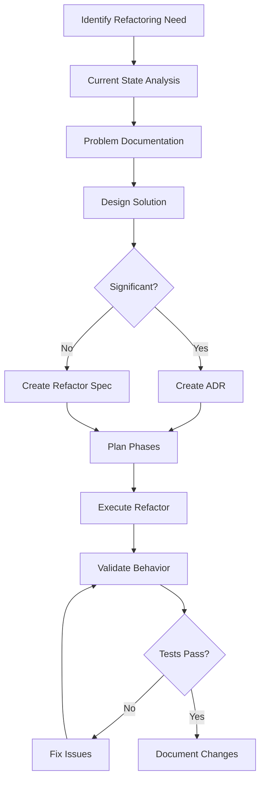

# Workflow: Refactoring

## Purpose
Systematically analyze, plan, and execute refactoring of existing code to improve structure, performance, or maintainability while preserving functionality.

## When to Use
- Code has accumulated technical debt
- Performance bottlenecks identified
- API needs restructuring
- Patterns need standardization
- Dependencies need updating
- Before major feature additions to problematic areas

## The Workflow



## Step-by-Step Process

### Step 1: Identify Refactoring Need

Common triggers:
- Performance metrics below threshold
- Repeated bug patterns
- Difficult feature additions
- Code review feedback
- Dependency updates required
- Design pattern violations

### Step 2: Current State Analysis

Document the existing implementation:
```markdown
## Current State Analysis

### Code Structure
- Location: [files/modules affected]
- Dependencies: [what it uses, what uses it]
- Patterns: [current design patterns]
- Metrics: [LOC, complexity, coverage]

### Behavior
- Input: [what it accepts]
- Output: [what it produces]
- Side effects: [state changes, I/O]
- Error cases: [how failures handled]

### Problems
1. [Specific issue with evidence]
2. [Another issue with metrics]
3. [Performance/maintainability concern]
```

### Step 3: Problem Documentation

Be specific about what needs fixing:
```markdown
## Problems to Solve

### Problem 1: [Title]
**Evidence**: [Metrics, logs, or code examples]
**Impact**: [How this affects the system]
**Root Cause**: [Why this problem exists]

### Problem 2: [Title]
**Evidence**: [Specific examples]
**Impact**: [User/developer experience]
**Root Cause**: [Technical debt source]
```

### Step 4: Design Solution

Create a detailed solution design:
```markdown
## Proposed Solution

### Approach
[High-level description of the refactoring approach]

### Key Changes
1. **Change 1**: [What and why]
2. **Change 2**: [What and why]
3. **Change 3**: [What and why]

### Before/After Comparison
```

### Step 5: Determine Significance

Create ADR if:
- ✅ Architectural changes involved
- ✅ Public API changes
- ✅ Cross-module impacts
- ✅ Performance trade-offs
- ✅ Breaking changes

Create Refactor Spec if:
- ✅ Internal implementation only
- ✅ Single module scope
- ✅ No API changes
- ✅ Straightforward improvements

### Step 6: Plan Refactoring Phases

Break into manageable phases:
```markdown
## Refactoring Plan

### Phase 1: Preparation [~X hours]
- [ ] Create comprehensive tests for current behavior
- [ ] Document current API if changing
- [ ] Set up performance benchmarks
- [ ] Create feature flags if needed

### Phase 2: Core Refactoring [~X hours]
- [ ] Make structural changes
- [ ] Update internal implementation
- [ ] Maintain backward compatibility
- [ ] Run tests continuously

### Phase 3: Migration [~X hours]
- [ ] Update consumers of changed code
- [ ] Remove deprecated code
- [ ] Update documentation
- [ ] Clean up feature flags

### Rollback Plan
If refactoring causes issues:
1. [How to detect failure]
2. [How to revert changes]
3. [What to preserve]
```

### Step 7: Execute Refactoring

Follow the plan with discipline:
- Make one logical change at a time
- Run tests after each change
- Commit at stable points
- Keep old and new code working together during transition

### Step 8: Validate Behavior

Ensure nothing broke:
```markdown
## Validation Checklist

### Functional Testing
- [ ] All existing tests pass
- [ ] New tests for refactored code pass
- [ ] Integration tests pass
- [ ] Manual testing completed

### Performance Testing
- [ ] Benchmarks show improvement/no regression
- [ ] Memory usage acceptable
- [ ] Load testing if applicable

### Code Quality
- [ ] Coverage maintained/improved
- [ ] Complexity reduced
- [ ] No new lint warnings
- [ ] Documentation updated
```

## Refactoring Specification Template

```markdown
# Refactoring Specification: [Component/Feature Name]

## Executive Summary
[1-2 paragraphs describing what's being refactored and why]

## Current State Analysis

### Implementation Overview
[How it currently works]

### Code Structure
```javascript
// Current structure example
class CurrentImplementation {
  // Problematic patterns
}
```

### Metrics
- Lines of Code: [current]
- Cyclomatic Complexity: [current]
- Test Coverage: [current]%
- Performance: [current metrics]

### Problems

#### Problem 1: [Problem Title]
**Description**: [What's wrong]
**Evidence**: 
```javascript
// Code showing the problem
```
**Impact**: [Why this matters]

#### Problem 2: [Problem Title]
**Description**: [What's wrong]
**Evidence**: [Metrics or examples]
**Impact**: [Effect on system]

## Proposed Solution

### Design Approach
[High-level description of the new design]

### Key Changes

#### Change 1: [Change Title]
**Current**:
```javascript
// Current problematic code
```

**Proposed**:
```javascript
// New improved code
```

**Rationale**: [Why this is better]

#### Change 2: [Change Title]
**Current**: [Current approach]
**Proposed**: [New approach]
**Benefits**: [What we gain]

### API Compatibility
- Breaking Changes: [List any]
- Deprecations: [What will be deprecated]
- Migration Path: [How to update]

## Implementation Plan

### Pre-refactoring
- [ ] Create comprehensive test suite
- [ ] Document current behavior
- [ ] Set up metrics baseline
- [ ] Create feature branch

### Phase 1: [Phase Name] [Estimated time]
- [ ] [Specific task]
- [ ] [Specific task]
- [ ] Validate: [What to check]

### Phase 2: [Phase Name] [Estimated time]
- [ ] [Specific task]
- [ ] [Specific task]
- [ ] Validate: [What to check]

### Phase 3: Cleanup [Estimated time]
- [ ] Remove old code
- [ ] Update documentation
- [ ] Remove feature flags
- [ ] Final testing

## Risk Analysis

| Risk | Likelihood | Impact | Mitigation |
|------|------------|--------|------------|
| [Risk 1] | High/Med/Low | High/Med/Low | [Strategy] |
| [Risk 2] | High/Med/Low | High/Med/Low | [Strategy] |

## Success Criteria

### Functional
- [ ] All tests pass
- [ ] No functionality lost
- [ ] Performance maintained/improved

### Quality
- [ ] Complexity reduced by X%
- [ ] Coverage increased to X%
- [ ] No new technical debt

### Timeline
- Total estimate: [X days]
- Critical path: [What must happen]
- Parallelizable work: [What can overlap]

## Validation Plan

### Testing Strategy
1. Run existing test suite
2. Add new tests for refactored areas
3. Performance benchmarks
4. Integration testing
5. User acceptance testing if needed

### Metrics to Track
- Before/After complexity scores
- Performance benchmarks
- Test coverage changes
- Build time impact

## Documentation Updates
- [ ] Update API documentation
- [ ] Update README if needed
- [ ] Update architecture docs
- [ ] Add migration guide
```

## Common Refactoring Patterns

### Pattern 1: Extract Service/Module
When a class/module has grown too large:
1. Identify cohesive functionality
2. Extract to new module
3. Define clear interface
4. Update consumers
5. Remove from original

### Pattern 2: Replace Algorithm
When performance needs improvement:
1. Benchmark current implementation
2. Implement new algorithm alongside
3. Add feature flag to switch
4. Validate with tests
5. Compare performance
6. Switch over when proven

### Pattern 3: Consolidate Duplication
When similar code exists in multiple places:
1. Identify all instances
2. Extract common pattern
3. Parameterize differences
4. Create shared implementation
5. Update all uses
6. Remove duplicates

### Pattern 4: Simplify Conditional Logic
When if/else chains become complex:
1. Map out all conditions
2. Identify patterns
3. Consider: Strategy pattern, lookup tables, polymorphism
4. Implement cleaner approach
5. Validate all paths

### Pattern 5: Update Dependencies
When libraries need updating:
1. Review breaking changes
2. Update in isolation
3. Fix compilation errors
4. Run tests
5. Update usage patterns
6. Remove deprecated features

## Anti-patterns to Avoid

### Anti-pattern 1: Big Bang Refactor
❌ Changing everything at once
✅ Incremental, phased approach

### Anti-pattern 2: Refactoring Without Tests
❌ Trusting that nothing will break
✅ Comprehensive test coverage first

### Anti-pattern 3: Perfect is the Enemy
❌ Trying to fix everything
✅ Focus on specific problems

### Anti-pattern 4: Silent Refactoring
❌ Not documenting changes
✅ Clear documentation of what and why

### Anti-pattern 5: No Rollback Plan
❌ Assuming refactor will work
✅ Always have a way back

## Integration with Other Workflows

### With Design Mode
For architectural refactoring:
1. Use Design Mode to explore options
2. Create ADR for significant changes
3. Reference in refactoring spec

### With Planning Mode
For complex refactoring:
1. Enter Planning Mode
2. Create detailed phase plan
3. Generate checklists
4. Execute systematically

### With Design Review
After refactoring:
1. Document new design
2. Request review
3. Address feedback
4. Iterate if needed

## Metrics to Track

- **Refactoring Frequency**: How often refactoring happens
- **Scope Creep**: Planned vs actual changes
- **Time Accuracy**: Estimated vs actual time
- **Quality Impact**: Metrics before/after
- **Regression Rate**: Bugs introduced

## Best Practices

### 1. Test First
✅ Write tests for current behavior before changing
❌ Refactor and hope tests catch issues

### 2. Small Steps
✅ Many small, verified changes
❌ One massive change

### 3. Maintain Working State
✅ Keep system working throughout
❌ Break now, fix later

### 4. Document Why
✅ Explain reasons for changes
❌ Just show what changed

### 5. Measure Impact
✅ Quantify improvements
❌ Assume it's better

## Common Refactoring Triggers

### Performance Triggers
- Response time > threshold
- Memory usage growing
- CPU usage excessive
- Database queries inefficient

### Maintainability Triggers
- Bug cluster areas
- Feature addition difficulty
- Test complexity
- Documentation gaps

### Design Triggers
- Violation of principles (SOLID, DRY)
- Circular dependencies
- God objects
- Inappropriate coupling

### Technical Debt Triggers
- Outdated dependencies
- Deprecated features used
- Security vulnerabilities
- Legacy patterns

## Example Refactoring Specs

### Example 1: Service Extraction
```markdown
# Refactoring: Extract Authentication Service

## Summary
The User model has grown to 2000+ lines with auth logic mixed with business logic. Extract authentication to dedicated service.

## Problems
- Single Responsibility violation
- Difficult to test auth in isolation
- Circular dependency with Session

## Solution
- Create AuthenticationService
- Move auth methods to service
- Inject service where needed
```

### Example 2: Performance Optimization
```markdown
# Refactoring: Optimize Search Algorithm

## Summary
Current linear search causing 5+ second delays for large datasets. Replace with indexed search.

## Problems
- O(n) search in hot path
- No caching of results
- Repeated calculations

## Solution
- Build search index on startup
- Implement caching layer
- Use binary search for sorted data
```

## Next Steps

1. Identify refactoring candidates in your codebase
2. Start with current state analysis
3. Document specific problems
4. Design solution approach
5. Create appropriate specs
6. Execute systematically
7. Validate thoroughly

Remember: Refactoring is about improving code without changing behavior. Always preserve functionality while improving structure!