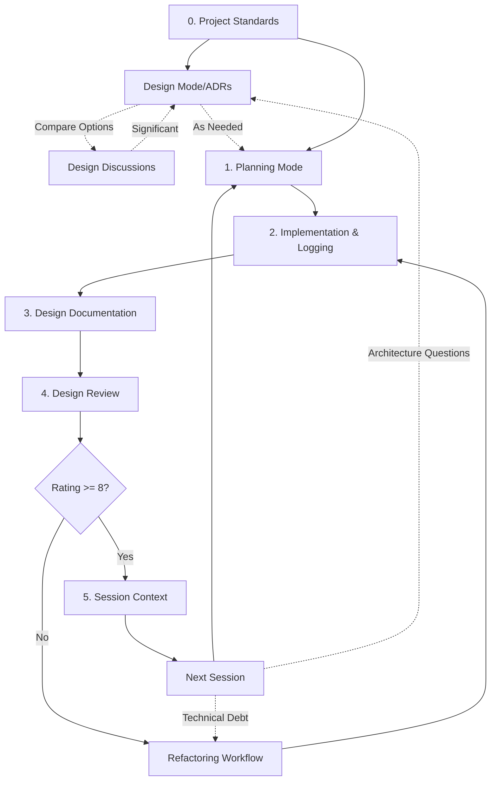

# Claude Development Workflows: Overview

## The Complete Development Pipeline

These workflows form a comprehensive system for building complex software with Claude. Each workflow represents a critical phase in the development lifecycle, designed to maximize quality, maintain context, and ensure systematic progress.

## Core Workflow Sequence



## Workflow Components

### 0. [Project Standards Workflow](workflow-0-project-standards.md)
**Purpose**: Establish technology stack, principles, and domain context  
**When**: At project inception, before any development  
**Outputs**: Standards document, CLAUDE.md, configured tools

### [Design Mode & ADR Workflow](workflow-design-mode-adr.md)
**Purpose**: Explore architectural solutions and document significant decisions  
**When**: Any time when facing architectural decisions  
**Outputs**: ADRs in `docs/architecture/adrs/`

### [Design Discussion Workflow](workflow-design-discussion.md)
**Purpose**: Compare multiple solutions using structured evaluation  
**When**: Need systematic comparison with criteria and scoring  
**Outputs**: Design discussions in `docs/discussions/`

### [Refactoring Workflow](workflow-refactoring.md)
**Purpose**: Systematically improve existing code without changing functionality  
**When**: Technical debt, performance issues, or before major feature additions  
**Outputs**: Refactoring specs, updated code, validation reports

### 1. [Planning Mode Workflow](workflow-1-planning-mode.md)
**Purpose**: Transform requirements into actionable plans and checklists  
**When**: Before starting any significant implementation  
**Outputs**: Plans and checklists in `docs/work/`

### 2. [Implementation & Logging Workflow](workflow-2-implementation.md) 
**Purpose**: Execute plans with comprehensive build/test logging  
**When**: After planning, during active coding  
**Outputs**: Working code with tests, logs in `logs/`

### 3. [Design Documentation Workflow](workflow-3-design-documentation.md)
**Purpose**: Document architectural decisions and implementation details  
**When**: After completing a phase of work  
**Outputs**: Design documents in `docs/designs/`

### 4. [Design Review Workflow](workflow-4-design-review.md)
**Purpose**: Evaluate quality from multiple perspectives  
**When**: After documenting design  
**Outputs**: Reviews, ratings, and refactoring plans

### 5. [Session Context Workflow](workflow-5-session-context.md)
**Purpose**: Preserve context between Claude sessions  
**When**: At the end of each work session  
**Outputs**: Context documents in `docs/context/`

## Directory Structure

```
docs/
├── architecture/         # Architecture documentation
│   └── adrs/            # Architecture Decision Records
│       ├── adr-001-technology-selection.md
│       ├── adr-002-event-sourcing.md
│       └── adr-003-api-versioning.md
├── discussions/          # Design discussions and comparisons
│   ├── dd-001-state-management.md
│   └── dd-002-api-protocol.md
├── standards/            # Project standards and principles
│   ├── project-standards.md
│   └── coding-guidelines.md
├── work/                 # Planning artifacts and checklists
│   ├── feature-plan.md
│   └── feature-phase1-checklist.md
├── designs/              # Design documentation
│   ├── parser-design.md
│   └── event-system-design.md
├── context/              # Session handoff documents
│   └── session-20241228-1430.md
└── book/                 # Workflow documentation
    ├── workflows-overview.md
    ├── workflow-0-project-standards.md
    ├── workflow-design-mode-adr.md
    ├── workflow-1-planning-mode.md
    ├── workflow-2-implementation.md
    ├── workflow-3-design-documentation.md
    ├── workflow-4-design-review.md
    └── workflow-5-session-context.md

logs/                     # Build and test logs (git-ignored)
├── all-build-20241228-1430.log
├── all-test-20241228-1435.log
├── parser-test-20241228-1440-failed.log
└── engine-build-20241228-1445.log

scripts/                  # Automation scripts
├── build-with-log.sh
├── test-with-log.sh
├── analyze-logs.sh
└── cleanup-logs.sh

Project Root Files:
├── CLAUDE.md            # Claude-specific instructions
├── README.md            # Project overview
├── ARCHITECTURE.md      # System design
├── package.json         # Dependencies and scripts
└── config.json          # Project configuration
```

## Quick Start Guide

### Starting a New Project

1. **Establish Standards**
   ```
   "Let's define project standards for [domain/type] project using [tech stack]"
   ```

2. **Create CLAUDE.md**
   ```
   "Create CLAUDE.md with our project standards and instructions"
   ```

### Making Architectural Decisions

1. **Enter Design Mode**
   ```
   "Let's enter design mode to explore [architectural concern]"
   ```

2. **Create ADR if Needed**
   ```
   "This decision is significant. Let's create an ADR documenting our choice."
   ```

### Starting a New Feature

1. **Check ADRs for Context**
   ```
   "Review relevant ADRs in docs/architecture/adrs/ for architectural constraints"
   ```

2. **Enter Planning Mode**
   ```
   "Claude, I need to plan [feature]. Let's enter planning mode."
   ```

3. **Execute Implementation**
   ```
   "Starting implementation using docs/work/feature-phase1-checklist.md"
   ```

3. **Document Design**
   ```
   "Help me document the design for this feature in docs/designs/"
   ```

4. **Request Review**
   ```
   "Review this design as a language/framework expert"
   ```

5. **Save Context**
   ```
   "Create a session context document for today's work"
   ```

### Refactoring Existing Code

1. **Analyze Current State**
   ```
   "Let's analyze [component] for refactoring opportunities"
   ```

2. **Create Refactoring Spec**
   ```
   "Create a refactoring specification for improving [component]"
   ```

3. **Execute Refactoring**
   ```
   "Let's proceed with the refactoring plan, starting with phase 1"
   ```

### Resuming Work

1. **Read Previous Context**
   ```
   "Read docs/context/session-[date].md to understand where we left off"
   ```

2. **Continue from Checklist**
   ```
   "Continue with docs/work/feature-phase2-checklist.md"
   ```

## Workflow Principles

### 1. Everything is Documented
- Plans before code
- Designs after implementation
- Reviews for quality assurance
- Context for continuity

### 2. Quality Gates
- Nothing ships with review rating < 8/10
- All code has tests
- All changes are reviewable

### 3. Continuous Improvement
- Reviews identify patterns
- Refactoring is systematic
- Learning is captured

### 4. Context Preservation
- No knowledge lost between sessions
- Clear handoffs
- Reproducible progress

## Benefits of This System

1. **Reduced Cognitive Load**: Don't hold everything in your head
2. **Consistent Quality**: Systematic reviews catch issues
3. **Learning Acceleration**: Reviews teach best practices
4. **Team Scalability**: Anyone can pick up where you left off
5. **Progress Visibility**: Clear tracking of what's done
6. **Knowledge Building**: Designs become references

## Advanced Techniques

### Parallel Workflows
Run multiple features through the pipeline simultaneously by maintaining separate `docs/work/` subdirectories.

### Review Rotation
Alternate between different review perspectives to catch diverse issues.

### Pattern Library
Extract common patterns from successful designs into reusable templates.

### Metric Tracking
Track review ratings over time to measure improvement.

## Common Pitfalls to Avoid

1. **Skipping Planning**: Always plan before implementing
2. **Incomplete Documentation**: Document while context is fresh
3. **Ignoring Low Ratings**: Always refactor when rating < 8
4. **Lost Context**: Write session summaries immediately
5. **Checklist Drift**: Keep checklists updated as you learn

## Next Steps

Choose a workflow to explore in detail:
- Start with [Planning Mode Workflow](workflow-1-planning-mode.md) if beginning new work
- Jump to [Session Context Workflow](workflow-5-session-context.md) if resuming work
- Review [Design Documentation Workflow](workflow-3-design-documentation.md) for quality practices

Each workflow document includes:
- Detailed templates
- Step-by-step instructions  
- Real examples
- Best practices
- Common variations